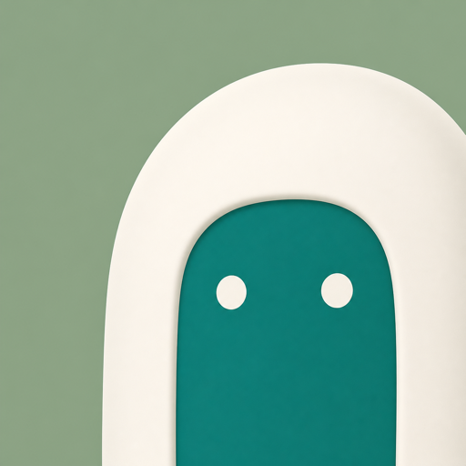

# Relmio brand kit

Relmio opens a door between the AI accounts people already use and the tools
where they work. The brand is friendly and calm: a small green character in a
cream doorway, set on soft sage. The interface pairs pastel yellow with warm
black: a yellow light theme and a black dark theme. Use this kit with
[DESIGN.md](DESIGN.md), which explains how the interface uses these values.

## Name

- Write **Relmio** in prose and `relmio` for the command and package.
- Older remote paths, Docker names, marker files and credential locations keep
  the `n8n-openai-oauth` name for compatibility. Use it only where an existing
  path or resource requires it.
- Product labels stay exact: n8n with ChatGPT sign-in, SuperGrok OAuth, n8n
  Code Sandbox, Codex Chat Adapter, Codex App Server, Local model.

## Logo

The logo is a teal two-eyed character inside a cream arch on a sage square.

| File | Use |
| --- | --- |
| `src/ui/relmio-icon.png` (512 x 512 PNG) | Master logo: README, social images, app icons, and the source of every copy below |
| `src/ui/relmio-icon-96.png` (96 x 96 PNG) | Top bar of the wizard and website (shown at 32 px). Regenerate from the master with `sips -Z 96 src/ui/relmio-icon.png --out src/ui/relmio-icon-96.png` when the master changes |
| `src/ui/relmio-icon-rounded.svg` | Favicons; a vector drawing of the same logo with a 112/512 corner radius |
| `docs/images/brand/relmio-logo.png`, `relmio-logo-rounded.svg` | Copies for documentation |
| `web/public/relmio-icon.png`, `relmio-icon-96.png`, `relmio-icon-rounded.svg` | Generated copies for the website (`npm run ui:sync`) |

Rules:

- Use the files as they are. Do not redraw, recolor, outline, rotate, stretch,
  crop further or add effects.
- Keep it square. Minimum size 20 px on screen; use 32 px in the top bar,
  where the interface rounds its corners by a quarter of its width.
- Leave clear space of at least one quarter of the logo width on every side.
- Place it on the canvas or surface colors in either theme. Do not put it on
  busy illustration or photos.
- Next to the logo, set the name in Bricolage Grotesque ExtraBold.

## Mascot and illustration

The mascot is the green character from the logo. It has two eyes and no mouth.
Its cream doorway is a separate object, so the mascot can stand in, near or
outside it.

- The animated banner (`docs/images/brand/relmio-banner-animated.svg`) and the
  home page scene are original vector drawings that follow the art direction
  study in `design-system/relmio/assets/relmio-banner-imagegen-source.png`.
- Scenes use the doorway, a VPS cloud and a local workshop. Keep shapes soft
  and rounded, with a dark pine outline.
- Scene backdrops follow the interface: a pastel yellow sky with warm ochre
  hills by day, a black sky with charcoal hills by night. The mascot stays teal
  and the doorway stays cream in both.
- Night scenes may add a moon, stars, a lit window and a blue sleep cap with
  closed eyes. Day scenes use open, blinking eyes.
- Illustration is decoration. Hide it from assistive technology and put any
  meaning in nearby text.

## Color

Brand constants come from the logo and do not change with the theme. Use them
in illustration, never for interface state.

| Name | Hex | Source |
| --- | --- | --- |
| Sage | `#8fa58b` | Logo background |
| Sage light | `#b0c0a6` | Logo background, top |
| Cream | `#f6f0e9` | Doorway and eyes |
| Mascot teal | `#087f7b` | Mascot body |
| Mascot teal deep | `#047c79` | Mascot body, shadow |
| Pine | `#12211f` | Ink and outlines |

Interface palette. CSS variables live in `src/ui/relmio-ui.css`. The light
theme is pastel yellow with warm black ink. The dark theme is black with warm
white ink and no green tint. The accent swaps between them: black buttons with
yellow text in light, yellow buttons with black text in dark. Teal is reserved
for the logo and mascot.

| Token | Light | Dark |
| --- | --- | --- |
| `--rm-canvas` | `#faeeb4` | `#0c0c0b` |
| `--rm-surface` | `#fff6cc` | `#171715` |
| `--rm-surface-muted` | `#f5e5a2` | `#21201d` |
| `--rm-surface-sunken` | `#efdc8e` | `#070706` |
| `--rm-ink` | `#1d1b16` | `#f6f3e8` |
| `--rm-ink-muted` | `#57503f` | `#b9b4a6` |
| `--rm-ink-subtle` | `#665e4b` | `#948f81` |
| `--rm-line` | `#e8d48a` | `#2b2a26` |
| `--rm-line-strong` | `#d2bb68` | `#3e3c37` |
| `--rm-field-line` | `#857650` | `#757164` |
| `--rm-accent` | `#1d1b16` | `#ffe17a` |
| `--rm-accent-hover` | `#36322a` | `#ffe994` |
| `--rm-on-accent` | `#fff1b3` | `#161512` |
| `--rm-accent-soft` | `#f6dc7c` | `#2c2611` |
| `--rm-accent-line` | `#c4a23a` | `#6e5c1f` |
| `--rm-accent-ink` | `#6b4f00` | `#ffe17a` |
| `--rm-focus` | `#1d1b16` | `#ffe17a` |
| `--rm-success` / soft | `#2e6b34` / `#dcefcd` | `#86d39a` / `#13241a` |
| `--rm-warning` / soft | `#9a4a00` / `#ffdfc0` | `#ffb36b` / `#2e1f10` |
| `--rm-danger` / soft | `#b42318` / `#fde0dc` | `#ff9a8f` / `#2e1615` |
| `--rm-terminal-bg` / fg / prompt | `#141413` / `#f5f1e3` / `#ffd54a` | same |

Measured contrast (WCAG 2.2 ratio):

| Pair | Light | Dark |
| --- | --- | --- |
| Ink on canvas | 14.71 | 17.62 |
| Muted ink on surface | 7.36 | 8.67 |
| Muted ink on canvas | 6.84 | 9.45 |
| Subtle ink on surface | 5.91 | 5.56 |
| Form control border on surface | 4.10 | 3.68 |
| Primary button on surface | 15.82 | 13.94 |
| Text on primary button | 15.14 | 14.18 |
| Accent ink on accent soft | 5.63 | 11.71 |
| Focus ring on canvas | 14.71 | 15.19 |
| Success on success soft | 5.28 | 9.11 |
| Warning on warning soft | 4.94 | 9.03 |
| Danger on danger soft | 5.28 | 8.27 |
| Terminal text on terminal | 16.30 | 16.30 |

Recheck these pairs when a token changes. Text needs 4.5:1; large text, icons
and control borders need 3:1.

## Typography

| Family | Role | File | License |
| --- | --- | --- | --- |
| Bricolage Grotesque, weights 700 to 800 | Name, display and page titles | `src/ui/fonts/bricolage-grotesque-latin.woff2` | SIL OFL 1.1 (`BricolageGrotesque-OFL.txt`) |
| Geist, variable 100 to 900 | Body and interface | `src/ui/fonts/geist-latin.woff2` | SIL OFL 1.1 (`Geist-OFL.txt`) |
| System monospace | Commands, IDs, eyebrows | None; uses the platform font | Not applicable |

Both font files are the Latin subsets from Google Fonts, served from the app's
own origin. The web app receives copies through `npm run ui:sync`.

- Headings and buttons use sentence case.
- Display text sits tight (line height 1.02, tracking -0.025em). Body text uses
  line height 1.55 and at most 75 characters per line.
- Never use Bricolage for body text, labels or long sentences.

## Icons

Relmio uses [Lucide](https://lucide.dev) outline icons at a 1.75 stroke, plus
the GitHub mark for the repository link. The kit embeds them as masks, so they
take the current text color: ``. Sizes: 14, 16, 18 (default) and 22 px. Licenses
are in NOTICE.

Do not mix icon sets, fill outline icons, or use emoji as icons. One
exception: the hosted site footer's X, LinkedIn, YouTube and Facebook links use
filled brand marks from `simple-icons@13.21.0` (CC0-1.0), drawn in
`currentColor` by the web `Icon` component. Use them only to identify those
services.

## Voice

Relmio speaks like a careful friend who knows servers: direct, warm and exact.

- Say what happens and what the person should do next. "Check the server
  identity before you connect."
- Name risks plainly once, where they matter. "This still writes to your
  server. Back up your workflows first."
- Prefer everyday words: "sign-in" over "authentication flow", "your server"
  over "the remote host". Put the technical name in a hint when it helps:
  "Technical name: SSH port."
- No hype, no exclamation marks, no emoji, no em dashes in interface text.
- Never claim provider approval, permanent model access or test coverage that
  has not been recorded.

## Asset index

| Asset | Path |
| --- | --- |
| Logo PNG | `src/ui/relmio-icon.png` |
| Logo SVG, rounded | `src/ui/relmio-icon-rounded.svg` |
| Animated banner | `docs/images/brand/relmio-banner-animated.svg` |
| Concept source | `docs/images/brand/relmio-concept-source.png` |
| Banner art direction study | `design-system/relmio/assets/relmio-banner-imagegen-source.png` |
| Doorway scene study | `design-system/relmio/assets/doorway-source.png` |
| Social image | `web/public/og.png` |
| UI kit | `src/ui/relmio-ui.css` |
| Fonts | `src/ui/fonts/` |
