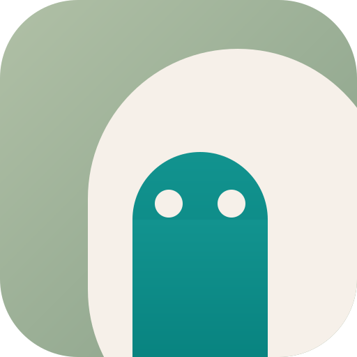

<p align="center">
  
</p>

# Relmio

Relmio helps you test a supported ChatGPT sign-in in a hosted chat, add private
companion services beside self-hosted n8n, or install a loopback-only local
endpoint. It keeps ChatGPT/Codex credentials, OpenAI Platform API keys, and
local client capabilities as three different contracts.

## Quick install

On macOS, Linux, WSL, or Git Bash:

```bash
npx --yes --ignore-scripts relmio@latest
```

The local wizard prints a private `127.0.0.1` setup URL, checks Docker, presents
the exact plan, and asks for final confirmation before it writes local files or
starts an n8n companion. Loopback endpoints stay on `127.0.0.1`; n8n companions
publish no host ports and are reachable only on the selected Docker network.
Other install options are on the [hosted install
page](https://relmio.vercel.app/install).

## Endpoints

| Option | Contract | Intended credential/client |
| --- | --- | --- |
| OpenAI API gateway | OpenAI-compatible `/v1` | User-supplied Platform API key; local apps and configured browser origins |
| Codex App Server | Experimental JSON-RPC over WebSocket | ChatGPT sign-in plus a high-trust local capability; trusted native clients |
| Codex Chat Adapter | Experimental `POST /chat` (JSON or opt-in SSE) | ChatGPT sign-in plus a local bearer; trusted local backends or development servers |
| n8n sidecar | Private `http://n8n-openai-oauth:10531/v1` | Existing n8n Docker network only |
| n8n AI Assistant companion | Private sandbox; opt-in SearXNG web search | User-owned OpenAI Platform API key entered directly in n8n |

The Codex targets are not generic `/v1` endpoints. ChatGPT sign-in is never an
OpenAI Platform API key or authorization for arbitrary OpenAI API calls.

## Local n8n bridge

Choose **Self-hosted n8n bridge** in the local browser wizard to install the
unofficial `openai-oauth` sidecar beside an existing, running local n8n
container. Relmio discovers n8n and its Docker networks read-only, binds the
reviewed plan to the exact selected container and network, copies the local
ChatGPT OAuth credential into a private managed volume, and starts only the new
sidecar. It does not edit, exec into, rebuild, restart, stop, or recreate n8n.

n8n uses `http://n8n-openai-oauth:10531/v1` with the placeholder API key
`local-only`. Relmio does not publish port `10531`, add an ngrok or reverse-proxy
route, or expose that URL through `127.0.0.1`. This option installs only the
private model bridge; the AI Assistant Code Sandbox, optional SearXNG, and an
Assistant model-provider credential remain separate, explicit setup choices.

## n8n AI Assistant companion

Choose **n8n AI Assistant tools** in the local browser wizard to install Code
Sandbox beside an existing local n8n container. SearXNG JSON web search is
optional and off by default. Relmio binds the exact container, Docker network,
and SearXNG choice to the reviewed plan, publishes no host port, and shows the
sandbox API key plus n8n environment settings once after verification. It does
not change or restart n8n; applying those settings remains your action.

For an SSH-reachable n8n host instead, run the separate Assistant wizard:

```bash
npx --yes --ignore-scripts relmio@latest assistant
```

Neither path reads ChatGPT/Codex OAuth. ChatGPT/Codex subscription sign-in is not
an OpenAI Platform API key and Relmio does not present it as the compliant
model route. AI Assistant is Preview: review every generated workflow before use. The
companion uses n8n's self-hosted privileged Docker-in-Docker runner for
advanced/local testing and keeps every host port unpublished. n8n recommends
Daytona for production sandboxing. Enter a user-owned Platform API key directly
in n8n; Relmio never handles it. Keep your current supported model selection,
including `openai/gpt-5.6-sol` while n8n continues to accept it.

The result view also shows an optional custom OpenAI-compatible route for a
separately deployed, Platform-key-backed Relmio endpoint. Its private Relmio
client credential is not an OpenAI-issued API key. The existing OAuth sidecar
remains experimental/private/policy-uncertain and is never auto-selected or
described as policy-approved. See the [AI Assistant guide](docs/ai-assistant.md).

The experimental Chat Adapter's SSE stream succeeds only after its
`terminal: completed` event. Its local tester stays behind the setup-token-
protected wizard and uses a short-lived encrypted credential handoff, never a
direct browser-to-adapter request.

## OpenAI policy evidence and limits

Relmio's supported paths follow published OpenAI product boundaries rather
than treating a ChatGPT subscription as a reusable API key:

- Relmio's maintainer was accepted into the [Codex for Open Source
  program](https://learn.chatgpt.com/docs/codex-for-oss-terms) for this project
  in August 2026 and received the program's limited-duration ChatGPT Pro
  benefit. The private acceptance email is retained by the maintainer and is
  not published because it contains personal account information.
- OpenAI's [advanced Codex configuration](https://learn.chatgpt.com/docs/config-file/config-advanced#oss-mode-local-providers)
  documents custom model providers and OSS mode with local providers such as
  Ollama and LM Studio.
- [Thibault “Tibo” Sottiaux](https://openai.com/index/openai-to-acquire-astral/),
  Codex Lead at OpenAI, has publicly stated that the Codex App, CLI, and SDK
  can use open-source models, and separately distinguished supported
  **Sign in with ChatGPT** clients from unsupported subscription-to-API
  conversion, resale, or multi-user sharing ([open-model statement](https://x.com/thsottiaux/status/2067399435009622521),
  [account-use statement](https://x.com/thsottiaux/status/2090675027670978569)).
- OpenAI CEO Sam Altman publicly announced ChatGPT-account sign-in for
  OpenClaw ([statement](https://x.com/sama/status/2050357911915028689)).

These sources are evidence for the specific documented patterns, not a blanket
OpenAI endorsement, legal opinion, contractual amendment, or promise that
every third-party adapter or future release is compliant. Program acceptance
supports the maintainer and open-source work; it is not a protocol-by-protocol
compliance certification.
Relmio therefore keeps native Codex traffic in the official App Server
lifecycle, does not present ChatGPT credentials as a generic `/v1` API key,
and requires a user-owned OpenAI Platform API key for the n8n AI Assistant
model route. Relmio prohibits account pooling or sharing, credential
forwarding, subscription-to-API conversion or resale, and rate-limit or
safeguard bypass. The legacy n8n OAuth sidecar remains
experimental/private/policy-uncertain. See the complete [policy evidence and
scope](docs/security.md#policy-evidence-and-scope).

## Critical security boundaries

- Loopback endpoints bind only to `127.0.0.1`; do not expose them through a
  LAN, reverse proxy, domain, or public IP.
- The local and VPS n8n installers create a separate sidecar. They never edit
  the existing n8n Compose file or image and never publish port `10531` on the
  host.
- The local AI Assistant option creates only its owned Code Sandbox and
  optional SearXNG project. It never changes or restarts n8n and publishes no
  companion host port.
- The Chat Adapter rejects browser origins. Its new in-wizard tester calls only
  the setup-token-protected local wizard, never the adapter from the browser.
- Local capabilities and the Chat Adapter bearer are sensitive. Do not put
  them in browser code, logs, or a shell command line.

## ChatGPT sign-in lifetime

ChatGPT/Codex sign-in tokens expire, but the official Codex client refreshes
them automatically during active use before they expire, so active sessions
usually continue without another browser login. The official [OpenAI
authentication documentation](https://learn.chatgpt.com/docs/auth) does not
publish a fixed 10-day lifetime; do not plan around one. This provider
credential is separate from Relmio's local capability, which remains valid
until you rotate it.

## Common problems

1. **Docker is not running.** Start Docker Desktop or Docker Engine with
   Compose, then reopen one fresh wizard session. See [Docker
   troubleshooting](https://relmio.vercel.app/docs/troubleshooting#docker-is-not-running).
2. **Authentication fails.** Close old wizard and sign-in tabs, use the newest
   printed wizard URL, and retry the device-code flow. See [authentication
   troubleshooting](https://relmio.vercel.app/docs/troubleshooting#authentication-fails).
3. **Local image build failed.** The wizard intentionally hides Docker stderr
   and local paths. Check Docker, disk space, and registry connectivity, then
   start a fresh reviewed plan. See [local image build
   troubleshooting](https://relmio.vercel.app/docs/troubleshooting#local-image-build-failed).

## Documentation

- [Getting started](https://relmio.vercel.app/docs/getting-started)
- [Local endpoints and the Chat Adapter](https://relmio.vercel.app/docs/local-endpoints)
- [VPS and n8n](https://relmio.vercel.app/docs/vps-and-n8n)
- [n8n AI Assistant companion](https://relmio.vercel.app/docs/ai-assistant)
- [Troubleshooting](https://relmio.vercel.app/docs/troubleshooting)
- [Security](https://relmio.vercel.app/docs/security)
- [Reference and safe test commands](https://relmio.vercel.app/docs/reference)

For source-level guides, see [`docs/`](docs/). Security guidance is in
[`docs/security.md`](docs/security.md). Relmio is licensed under the
[Apache License 2.0](LICENSE).

## Legal

Relmio is an unofficial, community-maintained project. It is not affiliated
with, endorsed by, or sponsored by OpenAI.

Treat ChatGPT/Codex credentials like passwords. Use only your own account,
keep credentials private, and never pool, share, or redistribute access
tokens. Any request made with those credentials must be authorized by the
account owner.

You are responsible for following OpenAI's [Terms of Use](https://openai.com/policies/terms-of-use/),
[Usage Policies](https://openai.com/policies/usage-policies/), and any other
agreement that applies to your account.

> [!WARNING]
> **Do not bypass rate limits, restrictions, or safeguards.**

Relmio is provided as-is without warranties. OpenAI or an upstream service may
change or discontinue access at any time, and you accept the risks of using
this experimental community project.
