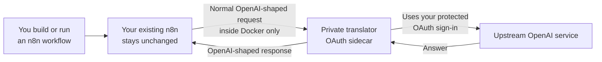
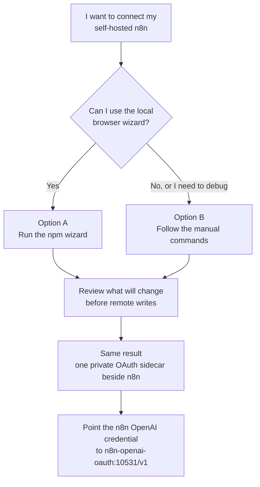
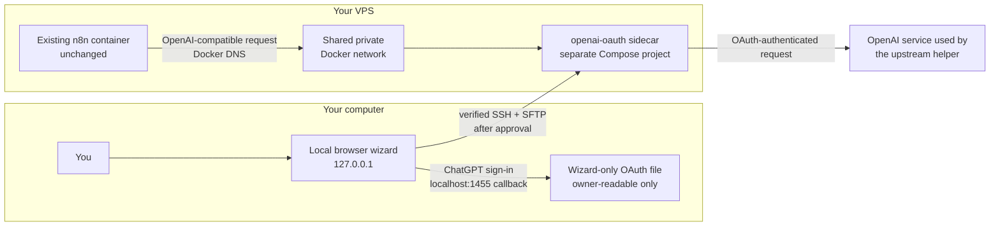
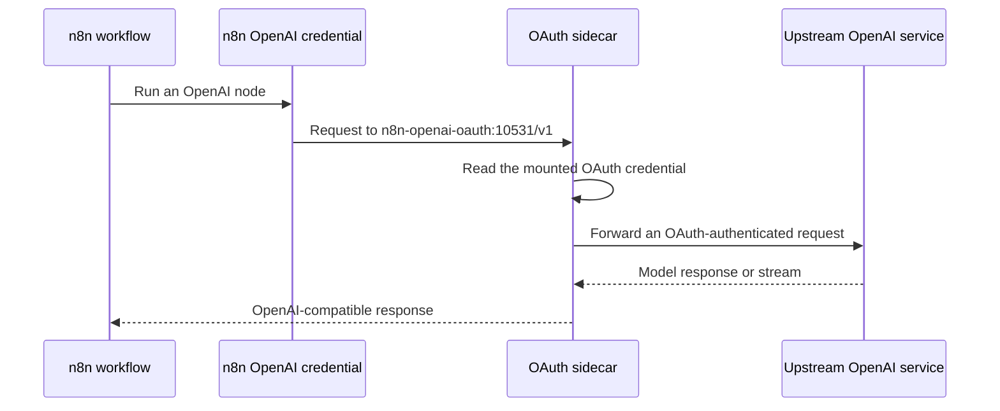

<div align="center">
  <h1>n8n OpenAI OAuth Setup</h1>
  <p>Connect self-hosted n8n to a private, OpenAI-compatible OAuth sidecar without changing your existing n8n deployment.</p>
  <p>
    <a href="#choose-a-setup-path">Get started</a>
    &nbsp;·&nbsp;
    <a href="https://github.com/Demonbane18/n8n-openai-oauth-setup/issues/new">Report an issue</a>
    &nbsp;·&nbsp;
    <a href="https://github.com/Demonbane18/n8n-openai-oauth-setup/stargazers">Leave a star</a>
  </p>
  <p>
    <a href="https://www.npmjs.com/package/n8n-openai-oauth-setup"></a>
    <a href="https://github.com/Demonbane18/n8n-openai-oauth-setup/actions/workflows/ci.yml"></a>
    <a href="package.json"></a>
    <a href="LICENSE"></a>
    <a href="https://github.com/Demonbane18/n8n-openai-oauth-setup/stargazers"></a>
  </p>
</div>

A local browser wizard that installs
[`openai-oauth@2.0.0`](https://github.com/EvanZhouDev/openai-oauth/releases/tag/v2.0.0)
as a separate Docker sidecar beside a self-hosted n8n instance. It guides a
VPS owner through ChatGPT sign-in, SSH host verification, n8n discovery, an
exact installation plan, and the final n8n credential settings.

The existing n8n image, Compose file, container, and workflows stay untouched.

> [!IMPORTANT]
> This does **not** create an OpenAI Platform API key. It creates a private,
> OpenAI-compatible endpoint that authenticates through a local ChatGPT/Codex
> OAuth session. The `local-only` value entered in n8n is only a placeholder
> for n8n's required API-key field.

> [!WARNING]
> This project and `openai-oauth` are unofficial community projects. They are
> not affiliated with or endorsed by OpenAI. Access, supported models, and
> limits depend on the signed-in ChatGPT account and can change. Use this only
> for personal, experimental workflows; protect the OAuth file like a
> password; and follow OpenAI's current terms and usage policies.

> [!CAUTION]
> This is experimental software provided without warranty. You use it at your
> own risk. To the fullest extent permitted by applicable law, the maintainer
> is not responsible for account restrictions, lost access, data loss, service
> interruption, financial loss, or any direct, indirect, incidental, or
> consequential loss resulting from use of this project. Review OpenAI's
> [Terms of Use](https://openai.com/policies/terms-of-use/), usage policies,
> ChatGPT/Codex terms, your n8n terms, and the upstream project's license and
> legal notices before using it. OpenAI may change or restrict the underlying
> service at any time.

> Similar community tools may use related OAuth/Codex flows, including Hermes
> Agent, but that similarity is not an OpenAI endorsement or a guarantee that
> every use is permitted. This project is not intended to bypass quotas,
> safeguards, account controls, or service restrictions.

<details>
<summary><strong>Table of contents</strong></summary>

- [What this does, in plain English](#what-this-does-in-plain-english)
- [Choose a setup path](#choose-a-setup-path)
- [Quick start with the npm package](#quick-start-with-the-npm-package)
- [Run from a repository clone](#run-from-a-repository-clone)
- [Manual setup and debugging](#manual-setup-and-debugging)
- [How it works behind the scenes](#how-it-works-behind-the-scenes)
- [What the wizard can and cannot change](#what-the-wizard-can-and-cannot-change)
- [Refresh, update, and remove](#refresh-update-and-remove)
- [Troubleshooting first steps](#troubleshooting-first-steps)
- [Release and version synchronization](#release-and-version-synchronization)
- [Documentation](#documentation)
- [Supported bridge behavior](#supported-bridge-behavior)
- [Contributing](#contributing)
- [Security and responsible disclosure](#security-and-responsible-disclosure)
- [Sources and further reading](#sources-and-further-reading)
- [License](#license)

</details>

## What this does, in plain English

n8n normally expects to talk to an OpenAI-compatible API using an API-key
field. This project adds a small, private “translator” beside n8n. n8n sends
its normal requests to that translator, and the translator uses your
ChatGPT/Codex OAuth sign-in for the upstream connection.



Think of the sidecar as an interpreter in a private room: n8n speaks the API
format it already knows, while the sidecar handles the different sign-in
method. The sidecar shares a private Docker network with n8n; port `10531` is
not published to the internet.

## Choose a setup path

Both methods create the same separate sidecar and leave the existing n8n
container, image, Compose file, and workflows alone.

| Path | Best for | What you do |
|---|---|---|
| **npm browser wizard** | Most users | Follow guided screens, verify the server identity, review the plan, then approve |
| **Manual setup** | Wizard failures, unusual VPS setups, debugging, and contributors | Run the underlying login, SSH, file, and Docker Compose steps yourself |



The wizard is a convenience layer, not a requirement. If it cannot run—or if
you want to inspect, reproduce, improve, or debug the method—use
[Manual setup and debugging](#manual-setup-and-debugging).

## Quick start with the npm package

### Requirements

- A local macOS, Windows, or Linux computer with
  [Node.js 22 or newer](https://nodejs.org/en/download)
- A browser and a ChatGPT account eligible to use the upstream Codex flow
- A self-hosted n8n Docker container on a VPS
- Docker Engine and Docker Compose v2 on the VPS
- The VPS address, SSH port, and root password
- A Docker network that n8n and the new sidecar can share

> [!WARNING]
> Export or otherwise back up your n8n workflows before using the wizard.
> The wizard is designed to create or update only its separate sidecar and
> does not issue n8n deletion, restart, or rebuild commands, but it still
> authenticates to your VPS and writes files there. Keep a recoverable backup
> before granting it access.

Do **not** run the npm command on the VPS. Run it on the computer where you
will complete the browser sign-in.

### 1. Start the newest published wizard

Open Terminal, PowerShell, or another local shell:

```bash
npx --yes --ignore-scripts n8n-openai-oauth-setup@latest
```

Keep that terminal open. The command starts a one-time web server on
`127.0.0.1`, prints a private session URL, and opens the wizard in your
browser. It does not globally install this package.

To confirm which version npm currently publishes:

```bash
npm view n8n-openai-oauth-setup version
```

> [!NOTE]
> Every wizard screenshot below comes from the built-in sanitized preview. It
> uses a reserved documentation IP, fake fingerprint, fake container data, and
> fake models. No real VPS, credential, or browser session is shown.

### 2. Complete or reuse the local ChatGPT sign-in

The wizard stores its validated credential at:

```text
~/.n8n-openai-oauth/auth.json
```

It does not reuse or overwrite the Codex app's `~/.codex/auth.json`. If a
credential already exists, **Continue to VPS** reuses it. Use **Refresh
ChatGPT sign-in** when it is expired, belongs to another account, or you want
a new session.

After a fresh login, check the **Credential updated** timestamp. It is shown
in your computer's local time so you can tell that the browser approval
actually reached the wizard.


If a browser extension named **Sign in with ChatGPT** or **OpenAI OAuth**
captures the callback, temporarily disable that extension and start the
refresh again from the wizard. The active wizard must receive the callback on
`localhost:1455`.

### 3. Verify the VPS before entering its password

Enter the VPS address exactly as your provider shows it. Select **Check server
identity**, compare the SHA-256 fingerprint with the intended server, and
confirm it before the password field unlocks.


The screenshot uses the reserved documentation address `192.0.2.10`, a fake
fingerprint, and an empty password field. Never publish a real password,
private key, session URL, or OAuth file.

### 4. Choose the detected n8n container and shared network

The wizard connects over SSH, runs read-only Docker discovery, and lists the
running n8n container and its networks. Choose the network that n8n should
share with the sidecar; on many Hostinger templates it is named `proxy`.


### 5. Review and approve the exact plan

Nothing is written during discovery. The review screen shows the single
managed directory, service, Docker network, and private hostname. It also
states the forbidden actions: no n8n edit, rebuild, restart, or recreation;
no host port; and no Traefik route.


Only after you select the approval checkbox can the wizard upload the OAuth
file and build the separate sidecar.

### 6. Copy the verified settings into n8n

The final screen appears only after the sidecar is healthy, the model list is
reachable, and Docker reports no published host port.


Use the button beside each value to copy it individually, or select
**Copy credential settings** for the labeled credential set. Then create or
edit an **OpenAI** credential in n8n:

**API Key**

```text
local-only
```

**Base URL**

```text
http://n8n-openai-oauth:10531/v1
```

**Organization ID:** leave empty.

**Add Custom Header**

```text
Off
```

For an **OpenAI Chat Model**:

- select one of the models returned by the bridge;
- on Chat Model node version 1.3, keep **Use Responses API** on;
- if that switch is absent, keep the node's default Chat Completions behavior;
- begin with a simple prompt and no built-in tools;
- add tools only after the basic request succeeds.

The bridge supports both `/v1/responses` and `/v1/chat/completions`.

For an **HTTP Request** node, an example endpoint is:

```text
POST http://n8n-openai-oauth:10531/v1/responses
```

n8n may send `Authorization: Bearer local-only`. The bridge does not treat
that placeholder as an OpenAI API key or secret.

For complete copy-paste recipes for an **AI Agent**, **Basic LLM Chain**, and
**HTTP Request** node—including an importable cURL command—open
[Configure n8n nodes](docs/n8n-configuration.md).

## Run from a repository clone

The npm command above is the recommended path. Contributors can instead run
the source checkout:

```bash
git clone https://github.com/Demonbane18/n8n-openai-oauth-setup.git
cd n8n-openai-oauth-setup
npm ci --ignore-scripts
npm start
```

On macOS, **Start Wizard.command** performs the install-and-start steps. On
Windows, use **Start Wizard.bat**.

## Manual setup and debugging

The manual method is intentionally supported. It is the fallback when the npm
wizard does not work, and it exposes every underlying step so technical users
can reproduce problems and contribute fixes. It creates the same separate
sidecar; it does not modify the existing n8n Compose project.

You need a POSIX shell (macOS, Linux, WSL, or Git Bash), Node.js 22 or newer,
SSH access to the VPS, Docker Compose v2 on the VPS, and the name of a Docker
network already used by n8n. Back up your n8n workflows before starting.

> [!CAUTION]
> Manual commands do not provide the wizard's validation guardrails. Check
> every replacement value, verify the SSH host fingerprint before entering a
> password, never print the OAuth file, and stop for a final review before the
> first remote write in step 3.

### 1. Create the OAuth file on your computer

Run this on your own computer, not on the VPS:

```bash
install -d -m 0700 "$HOME/.n8n-openai-oauth"
npx --yes --ignore-scripts openai-oauth@2.0.0 login \
  --open \
  --login-timeout-ms 300000 \
  --oauth-file "$HOME/.n8n-openai-oauth/auth.json"
test -s "$HOME/.n8n-openai-oauth/auth.json" \
  && echo "OAuth file is ready"
```

Complete the browser sign-in opened by the newest command. The dedicated file
does not reuse or overwrite `~/.codex/auth.json`. Treat both files like
passwords.

### 2. Verify and inspect the VPS

Connect from your computer:

```bash
ssh root@YOUR_VPS_IP
```

On the first connection, compare the displayed SSH fingerprint with the one
from your VPS provider before accepting it. Then list the containers:

```bash
docker ps --format 'table {{.Names}}\t{{.Image}}\t{{.Ports}}'
```

Find the container using the official n8n image and inspect its networks,
replacing `n8n-n8n-1` with its actual container name:

```bash
docker inspect n8n-n8n-1 --format '{{range $name, $_ := .NetworkSettings.Networks}}{{println $name}}{{end}}'
```

Record one existing network name that the new sidecar can share with n8n. It
is commonly `proxy`, but use the name returned by your own VPS.

### 3. Review, then create only the sidecar directory

Before continuing, confirm all three facts:

- the SSH fingerprint belongs to the intended VPS;
- the selected container is your existing n8n container;
- the selected Docker network is already attached to that n8n container.

Only after that final human review, create the separate directories:

```bash
install -d -m 0755 /docker/n8n-openai-oauth
install -d -m 0700 -o 1000 -g 1000 /docker/n8n-openai-oauth/auth
```

Create `/docker/n8n-openai-oauth/Dockerfile` with exactly:

```dockerfile
FROM node:22-bookworm-slim

RUN npm install --global --ignore-scripts openai-oauth@2.0.0 \
    && npm cache clean --force

USER node

ENTRYPOINT ["openai-oauth"]
CMD ["--host", "0.0.0.0", "--port", "10531", "--oauth-file", "/home/node/.codex/auth.json"]
```

Create `/docker/n8n-openai-oauth/docker-compose.yml` with exactly the following.
If the chosen network is not `proxy`, change only the final `name: proxy` line.

```yaml
services:
  openai-oauth:
    build:
      context: .
      dockerfile: Dockerfile
    restart: unless-stopped
    init: true
    volumes:
      - ./auth:/home/node/.codex
    expose:
      - "10531"
    networks:
      n8n-shared:
        aliases:
          - n8n-openai-oauth
    security_opt:
      - no-new-privileges:true
    cap_drop:
      - ALL
    read_only: true
    tmpfs:
      - /tmp:size=16m,mode=1777
      - /home/node/.local:uid=1000,gid=1000,mode=0700
    pids_limit: 128
    mem_limit: 512m
    cpus: 1.0
    healthcheck:
      test:
        - CMD
        - node
        - -e
        - 'fetch("http://127.0.0.1:10531/health").then((response) => process.exit(response.ok ? 0 : 1)).catch(() => process.exit(1))'
      interval: 30s
      timeout: 5s
      retries: 3
      start_period: 20s
    labels:
      io.n8n-openai-oauth.managed: "true"

networks:
  n8n-shared:
    external: true
    name: proxy
```

There is deliberately no `ports:` section and no Traefik label.

### 4. Copy the protected OAuth file

Leave the VPS shell:

```bash
exit
```

Run `scp` on your own computer:

```bash
scp "$HOME/.n8n-openai-oauth/auth.json" \
  root@YOUR_VPS_IP:/docker/n8n-openai-oauth/auth/auth.json
```

Reconnect and apply owner-only permissions on the VPS:

```bash
ssh root@YOUR_VPS_IP
chown 1000:1000 /docker/n8n-openai-oauth/auth/auth.json
chmod 600 /docker/n8n-openai-oauth/auth/auth.json
```

### 5. Validate, build, and start only the sidecar

Use the explicit Compose project and file on every command:

```bash
docker compose \
  --project-name n8n-openai-oauth \
  --file /docker/n8n-openai-oauth/docker-compose.yml \
  config --quiet

docker compose \
  --project-name n8n-openai-oauth \
  --file /docker/n8n-openai-oauth/docker-compose.yml \
  build openai-oauth

docker compose \
  --project-name n8n-openai-oauth \
  --file /docker/n8n-openai-oauth/docker-compose.yml \
  up -d --wait --wait-timeout 60 --no-deps openai-oauth
```

These commands name only the separate `openai-oauth` service. They do not
reference the existing n8n Compose file or service.

### 6. Verify the private bridge

Check its final logs:

```bash
docker compose \
  --project-name n8n-openai-oauth \
  --file /docker/n8n-openai-oauth/docker-compose.yml \
  logs --tail=50 openai-oauth
```

Prove that port `10531` is not published on the VPS:

```bash
docker compose \
  --project-name n8n-openai-oauth \
  --file /docker/n8n-openai-oauth/docker-compose.yml \
  port openai-oauth 10531
```

Success is no output. Then verify the model endpoint from inside the sidecar:

```bash
docker compose \
  --project-name n8n-openai-oauth \
  --file /docker/n8n-openai-oauth/docker-compose.yml \
  exec -T openai-oauth \
  node -e 'fetch("http://127.0.0.1:10531/v1/models").then(async (response) => { console.log(await response.text()); process.exit(response.ok ? 0 : 1); }).catch(() => process.exit(1))'
```

### 7. Configure n8n

Use the same credential settings as the wizard:

```text
API Key: local-only
Organization ID: leave empty
Base URL: http://n8n-openai-oauth:10531/v1
Add Custom Header: off
```

Do not use `127.0.0.1` in n8n; inside its container, that address means n8n
itself. For more explanations, common shell mistakes, and expected output, see
the [expanded beginner manual installation guide](docs/manual-install.md).

## How it works behind the scenes



The design works because four independent features line up:

1. n8n's OpenAI credential accepts a custom Base URL.
2. `openai-oauth` exposes OpenAI-compatible routes such as `/v1/models`,
   `/v1/responses`, and `/v1/chat/completions`.
3. Docker DNS lets n8n reach the sidecar by the private hostname
   `n8n-openai-oauth` on a shared network.
4. The upstream helper uses the mounted OAuth credential for its upstream
   authentication, while n8n sends the harmless `local-only` placeholder.

The request flow after installation is:



See [Architecture and n8n safety boundary](docs/architecture.md) for the
mutation boundary and command-level design.

## What the wizard can and cannot change

The wizard:

- reads the running n8n container and networks with read-only Docker commands;
- writes only under `/docker/n8n-openai-oauth`;
- creates a separate Compose project named `n8n-openai-oauth`;
- builds and starts only the `openai-oauth` service;
- uploads the OAuth file through SFTP with owner-only permissions;
- joins an existing Docker network;
- verifies that port `10531` is not published.

It never edits the n8n Compose file or image and never builds, restarts, stops,
recreates, or removes the n8n container. It also creates no Traefik route.
Automated tests enforce this boundary.

## Refresh, update, and remove

To refresh an expired ChatGPT session, run the same npm command again, choose
**Refresh ChatGPT sign-in**, verify the timestamp, and approve the update to
the same wizard-managed sidecar:

```bash
npx --yes --ignore-scripts n8n-openai-oauth-setup@latest
```

The update targets only the sidecar. It does not restart n8n. For rollback,
recoverable uninstall, and pinned upstream upgrades, follow
[Refresh, upgrade, rollback, and uninstall](docs/maintenance.md).

## Troubleshooting first steps

- **Old wizard version:** close the old terminal and run the `@latest` command.
- **Browser did not open:** copy the newest printed `127.0.0.1` URL into the
  browser while its terminal remains open.
- **Sign-in says expired:** close the old OAuth tab and begin a fresh refresh
  from the active wizard.
- **Extension page appears:** temporarily disable the extension that captured
  `localhost:1455`.
- **SSH fails:** recheck the full address, port, root password, provider
  firewall, and confirmed fingerprint.
- **n8n cannot connect:** use
  `http://n8n-openai-oauth:10531/v1`, never `127.0.0.1`.

See the full symptom matrix in [Troubleshooting](docs/troubleshooting.md).

## Release and version synchronization

`package.json` is the release version source of truth. The repository also
keeps these values synchronized:

- `package-lock.json` package and root-package versions;
- the newest version heading in [CHANGELOG.md](CHANGELOG.md);
- the Git tag `v<version>` for tagged builds.

`npm run release:check` rejects a mismatch among those local release files
and, on a tag build, the Git tag. The npm badge is an informational view of
the registry's cached `latest` version; the maintainer guide performs a
separate post-publish equality check against the registry. Maintainers must
bump and commit the repository version before publishing that same immutable
version to npm. Publishing npm first does not automatically rewrite Git
history or the README. Follow the
[npm maintainer publishing guide](docs/npm-publish.md) for the ordered release
procedure.

## Documentation

- [Changelog](CHANGELOG.md)
- [Troubleshooting](docs/troubleshooting.md)
- [OpenAI credential and node recipes](docs/n8n-configuration.md)
- [Beginner manual installation](docs/manual-install.md)
- [Security and limitations](docs/security.md)
- [Architecture and n8n safety boundary](docs/architecture.md)
- [Refresh, upgrade, rollback, and uninstall](docs/maintenance.md)
- [YouTube walkthrough outline](docs/video-outline.md)
- [npm maintainer publishing guide](docs/npm-publish.md)
- [Contributing](CONTRIBUTING.md)
- [Approved scope](SPEC.md)

## Supported bridge behavior

The pinned upstream `2.0.0` release documents:

- `/v1/models`;
- `/v1/responses`;
- `/v1/chat/completions`;
- streaming and tool calls.

Available models depend on the ChatGPT account and may change. The upstream
Responses implementation is stateless, so callers must send the conversation
history needed for each request.

## Contributing

Pull requests and focused issue reports are welcome. Before opening a PR,
please read [CONTRIBUTING.md](CONTRIBUTING.md), run the local checks, and keep
the change scoped to one improvement. Never commit OAuth files, passwords,
private keys, live session URLs, real VPS addresses, or screenshots containing
account or infrastructure details.

<p>
  <a href="CONTRIBUTING.md">Contribution guide</a>
  &nbsp;·&nbsp;
  <a href="https://github.com/Demonbane18/n8n-openai-oauth-setup/compare">Submit a pull request</a>
  &nbsp;·&nbsp;
  <a href="https://github.com/Demonbane18/n8n-openai-oauth-setup/issues/new">Open an issue</a>
</p>

## Security and responsible disclosure

Please use the private reporting path described in
[Security and limitations](docs/security.md) for suspected vulnerabilities.
Do not publish credentials, OAuth material, host details, or an exploit in a
public issue.

If this project saves you time, please consider [starring the repository](https://github.com/Demonbane18/n8n-openai-oauth-setup/stargazers).

## Sources and further reading

- [`openai-oauth` v2.0.0 release](https://github.com/EvanZhouDev/openai-oauth/releases/tag/v2.0.0)
- [`openai-oauth` v2.0.0 server routes](https://github.com/EvanZhouDev/openai-oauth/blob/v2.0.0/packages/openai-oauth/src/server.ts)
- [`openai-oauth` v2.0.0 login flow](https://github.com/EvanZhouDev/openai-oauth/blob/v2.0.0/packages/openai-oauth/src/login.ts)
- [n8n OpenAI credential documentation](https://docs.n8n.io/integrations/builtin/credentials/openai/)
- [n8n OpenAI credential source](https://github.com/n8n-io/n8n/blob/master/packages/nodes-base/credentials/OpenAiApi.credentials.ts)
- [n8n OpenAI Chat Model source](https://github.com/n8n-io/n8n/blob/master/packages/%40n8n/nodes-langchain/nodes/llms/LMChatOpenAi/LmChatOpenAi.node.ts)
- [Docker Compose networking](https://docs.docker.com/compose/how-tos/networking/)
- [Docker Compose `expose`](https://docs.docker.com/reference/compose-file/services/#expose)
- [Docker port publishing](https://docs.docker.com/engine/network/port-publishing/)
- [OpenAI: using Codex with a ChatGPT plan](https://help.openai.com/en/articles/11369540-using-codex-with-your-chatgpt-plan)
- [OpenAI Terms of Use](https://openai.com/policies/terms-of-use/)
- [npm semantic versioning](https://docs.npmjs.com/about-semantic-versioning/)

## License

[MIT](LICENSE). The upstream `openai-oauth` project has its own license and
legal notice; review both before distributing or deploying this setup.
