<div align="center">
  
  <h1>Relmio</h1>
  <p>Relay a supported ChatGPT/Codex sign-in to OpenAI-compatible clients, starting with self-hosted n8n.</p>
  <p>
    <a href="#choose-a-setup-path">Get started</a>
    &nbsp;·&nbsp;
    <a href="https://relmio.vercel.app/">Hosted ChatGPT site</a>
    &nbsp;·&nbsp;
    <a href="https://github.com/Demonbane18/relmio/issues/new">Report an issue</a>
    &nbsp;·&nbsp;
    <a href="https://github.com/Demonbane18/relmio/stargazers">Leave a star</a>
  </p>
  <p>
    <a href="https://www.npmjs.com/package/relmio"></a>
    <a href="https://github.com/Demonbane18/relmio/actions/workflows/ci.yml"></a>
    <a href="package.json"></a>
    <a href="LICENSE"></a>
    <a href="https://github.com/Demonbane18/relmio/stargazers"></a>
  </p>
</div>

## See it working first

This documented example follows a tested n8n OpenAI credential through a
published Telegram-triggered workflow. It is a product-operation record, not
an endorsement, sponsorship, or affiliation by OpenAI, n8n, Hostinger,
Telegram, or AppBuildersPH.

<figure>
  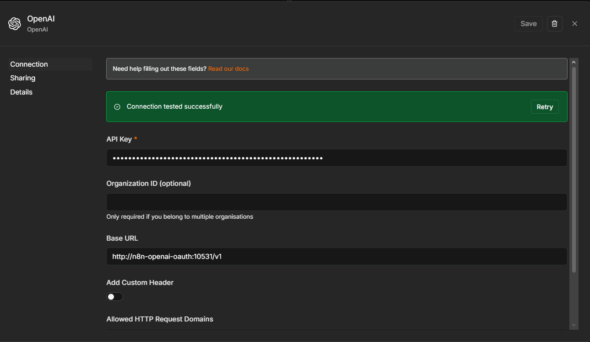
  <figcaption>The n8n OpenAI credential connection test succeeded; the credential value itself is obscured.</figcaption>
</figure>

<figure>
  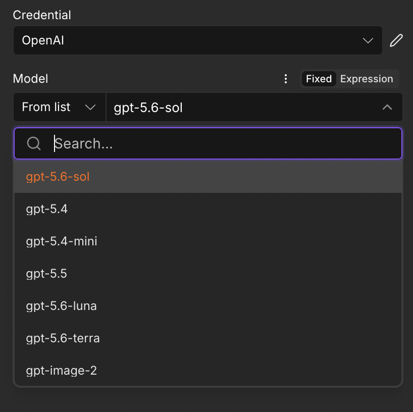
  <figcaption>This signed-in account's n8n model list includes <code>gpt-5.6-terra</code>; model availability is account-dependent and can change.</figcaption>
</figure>

<figure>
  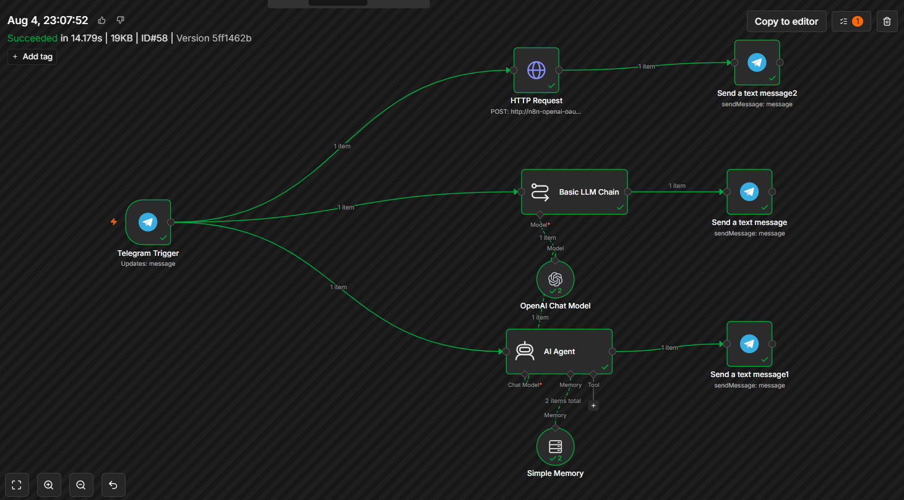
  <figcaption>The published Telegram-triggered n8n workflow completed successfully across its HTTP Request, Basic LLM Chain, and AI Agent branches.</figcaption>
</figure>

<figure>
  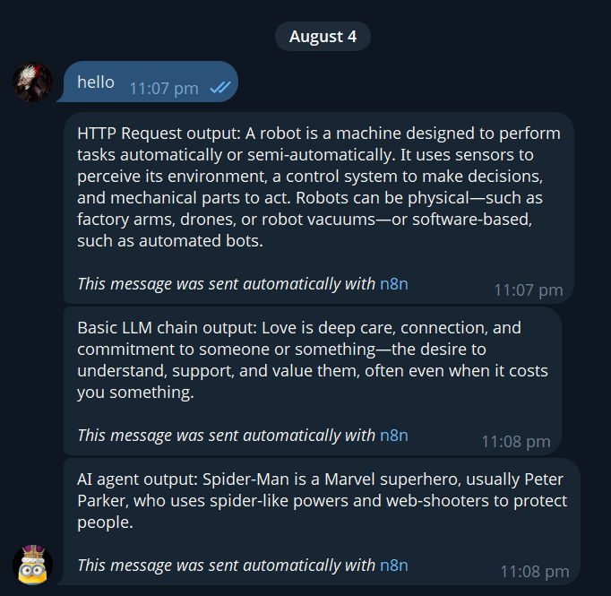
  <figcaption>Telegram received the HTTP Request, Basic LLM Chain, and AI Agent outputs sent by that workflow.</figcaption>
</figure>

## Quick install

Choose the terminal already on your own computer. Do not run these commands on
the VPS.

### macOS, Linux, WSL, or Git Bash

```bash
curl -fsSL https://relmio.vercel.app/install.sh | sh
```

### Homebrew (macOS or Linux)

```bash
brew tap Demonbane18/relmio && brew install relmio
```

### Windows PowerShell

```powershell
irm https://relmio.vercel.app/install.ps1 | iex
```

### Windows Command Prompt

```bat
for /f "delims=" %F in ("%TEMP%\relmio-install-%RANDOM%-%RANDOM%-%RANDOM%.cmd") do @if exist "%~F" (exit /b 80) else curl -fsSL --remove-on-error https://relmio.vercel.app/install.cmd -o "%~F" && set "RELMIO_SELF_DELETE=%~F" && call "%~F"
```

These commands start the wizard without installing Node.js or Git Bash first.
The open-source [POSIX](web/public/install.sh), [Windows PowerShell](web/public/install.ps1),
and [Command Prompt](web/public/install.cmd) bootstraps reuse Node.js 22 or
newer when it is already available. Otherwise they show staged download,
verification, and extraction messages while they download the matching current
official Node.js 22 runtime to a private temporary directory, verify its
SHA-256 checksum, run Relmio with npm lifecycle scripts disabled, and remove
the temporary runtime when the wizard closes. They do not install Node.js
system-wide.

Homebrew is available from the public `Demonbane18/relmio` tap. The WinGet
command stays hidden until Microsoft accepts its catalog pull request and the
catalog updates. Until then, use Homebrew or a direct installer above.

The Command Prompt route is PowerShell-free, runs as the current user, and
does not request administrator access or change Windows security policy. Keep
the terminal open while its temporary-runtime stages say **Please wait**.

Already have Node.js 22 or newer? You can use NPX instead:

```bash
npx --yes --ignore-scripts relmio@latest
```

Relmio is a local browser wizard that currently installs
[`openai-oauth@2.0.0`](https://github.com/EvanZhouDev/openai-oauth/releases/tag/v2.0.0)
as a separate Docker sidecar beside a self-hosted n8n instance. It guides a
VPS owner through ChatGPT sign-in, SSH host verification, n8n discovery, an
exact installation plan, and the final n8n credential settings.

The existing n8n image, Compose file, container, and workflows stay untouched.

The public name is intentionally broader than n8n. The current release is an
n8n-focused setup path; the product direction is to make the same private,
OpenAI-compatible endpoint usable by local chatbots, custom applications, the
OpenAI SDK, and other compatible clients without tying the project identity to
one automation platform.

> [!IMPORTANT]
> This does **not** create an OpenAI Platform API key. It creates a private,
> OpenAI-compatible endpoint that authenticates through a local ChatGPT/Codex
> OAuth session. The `local-only` value entered in n8n is only a placeholder
> for n8n's required API-key field.

> [!WARNING]
> This project and `openai-oauth` are unofficial community projects. They are
> not affiliated with or endorsed by OpenAI. Access, supported models, and
> limits depend on the signed-in ChatGPT account and can change. Use this only
> for personal, experimental workflows; protect the OAuth file like a
> password; and follow OpenAI's current terms and usage policies.

> [!CAUTION]
> This is experimental software provided without warranty. You use it at your
> own risk. To the fullest extent permitted by applicable law, the maintainer
> is not responsible for account restrictions, lost access, data loss, service
> interruption, financial loss, or any direct, indirect, incidental, or
> consequential loss resulting from use of this project. Review OpenAI's
> [Terms of Use](https://openai.com/policies/terms-of-use/), usage policies,
> ChatGPT/Codex terms, your n8n terms, and the upstream project's license and
> legal notices before using it. OpenAI may change or restrict the underlying
> service at any time.

> Similar community tools may use related OAuth/Codex flows, including Hermes
> Agent, but that similarity is not an OpenAI endorsement or a guarantee that
> every use is permitted. This project is not intended to bypass quotas,
> safeguards, account controls, or service restrictions.

<details>
<summary><strong>Table of contents</strong></summary>

- [What this does, in plain English](#what-this-does-in-plain-english)
- [What is a sidecar?](#what-is-a-sidecar)
- [See it working first](#see-it-working-first)
- [Current scope and direction](#current-scope-and-direction)
- [GPT-5.6 AI Agent example](#gpt-56-ai-agent-example)
- [Hosted ChatGPT site](#hosted-chatgpt-site)
- [Browser interface and theme modes](#browser-interface-and-theme-modes)
- [Choose a setup path](#choose-a-setup-path)
- [Quick start with the npm package](#quick-start-with-the-npm-package)
- [Run from a repository clone](#run-from-a-repository-clone)
- [Manual setup and debugging](#manual-setup-and-debugging)
- [How it works behind the scenes](#how-it-works-behind-the-scenes)
- [What the wizard can and cannot change](#what-the-wizard-can-and-cannot-change)
- [Refresh, update, and remove](#refresh-update-and-remove)
- [Troubleshooting first steps](#troubleshooting-first-steps)
- [Release and version synchronization](#release-and-version-synchronization)
- [Documentation](#documentation)
- [Supported bridge behavior](#supported-bridge-behavior)
- [Known limitations](#known-limitations)
- [Legal](#legal)
- [Contributing](#contributing)
- [Security and responsible disclosure](#security-and-responsible-disclosure)
- [Sources and further reading](#sources-and-further-reading)
- [License](#license)

</details>

## What this does, in plain English

n8n normally expects to talk to an OpenAI-compatible API using an API-key
field. This project adds a small, private “translator” beside n8n. n8n sends
its normal requests to that translator, and the translator uses your
ChatGPT/Codex OAuth sign-in for the upstream connection.

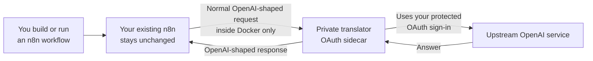
```mermaid
flowchart LR
  You["You build or run<br/>an n8n workflow"]
  N8N["Your existing n8n<br/>stays unchanged"]
  Bridge["Private translator<br/>OAuth sidecar"]
  OpenAI["Upstream OpenAI service"]

  You --> N8N
  N8N -->|"Normal OpenAI-shaped request<br/>inside Docker only"| Bridge
  Bridge -->|"Uses your protected<br/>OAuth sign-in"| OpenAI
  OpenAI -->|"Answer"| Bridge
  Bridge -->|"OpenAI-shaped response"| N8N
```

Think of the sidecar as an interpreter in a private room: n8n speaks the API
format it already knows, while the sidecar handles the different sign-in
method. The sidecar shares a private Docker network with n8n; port `10531` is
not published to the internet.

## What is a sidecar?

A sidecar is a small helper program that runs beside a larger program. It adds
one missing capability without changing the main program. In Relmio, your n8n
stays as it is; the private sidecar handles ChatGPT/Codex sign-in and translates
n8n's normal requests. Remove the sidecar and your existing n8n is still
unchanged.

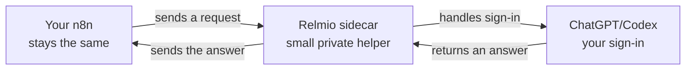
```mermaid
flowchart LR
  N8N["Your n8n<br/>stays the same"]
  Sidecar["Relmio sidecar<br/>small private helper"]
  ChatGPT["ChatGPT/Codex<br/>your sign-in"]

  N8N -->|"sends a request"| Sidecar
  Sidecar -->|"handles sign-in"| ChatGPT
  ChatGPT -->|"returns an answer"| Sidecar
  Sidecar -->|"sends the answer"| N8N
```

This is the standard sidecar pattern: a small, modular helper alongside an
existing application. For a beginner-friendly overview, see
[Justin Rice's explanation of software sidecars](https://medium.com/@justinricedev/what-is-a-software-sidecar-8f89feff09f9).

### A tricycle is a useful analogy

Think of n8n as a motorcycle: it already gets your workflow where it needs to
go. Relmio adds a sidecar, turning the pair into a tricycle with extra room for
passengers. The motorcycle remains the same, while the sidecar adds a new
capability, in this case ChatGPT/Codex sign-in and translation for n8n.

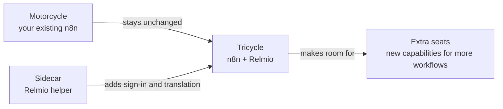
```mermaid
flowchart LR
  Motorcycle["Motorcycle<br/>your existing n8n"]
  Sidecar["Sidecar<br/>Relmio helper"]
  Tricycle["Tricycle<br/>n8n + Relmio"]
  Passengers["Extra seats<br/>new capabilities for more workflows"]

  Motorcycle -->|"stays unchanged"| Tricycle
  Sidecar -->|"adds sign-in and translation"| Tricycle
  Tricycle -->|"makes room for"| Passengers
```

## Current scope and direction

**Available now:** Relmio signs in locally, verifies a VPS over SSH, and
deploys a private sidecar beside self-hosted n8n. The wizard provides tested
settings and recipes for the OpenAI Chat Model, AI Agent, Basic LLM Chain, and
HTTP Request nodes.

**Designed to grow:** the Relmio name, mark, and package are client-neutral
so later releases can offer safe setup paths for OpenAI-compatible SDKs, local
chatbots, and other custom applications. Those broader clients are a product
direction, not a claim about the current installer: today, do not expose the
sidecar port publicly or deploy it outside the documented n8n safety boundary.
See the [provider and client roadmap](docs/roadmap.md), including the gated
SuperGrok/xAI OAuth feasibility track.

## GPT-5.6 AI Agent example

The screenshots below show a successful n8n AI Agent test using the GPT-5.6
model aliases `gpt-5.6-sol` and `gpt-5.6-luna`. The workflow combines a chat
trigger, an AI Agent, an OpenAI Chat Model, and Simple Memory. Both model
configurations successfully answer the same `what is a bidet?` prompt.

<figure>
  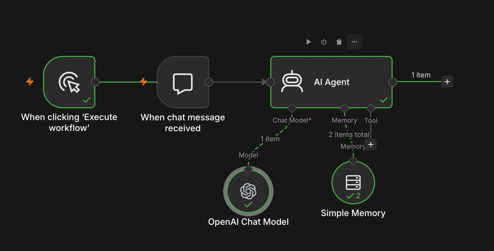
  <figcaption>Workflow topology: a chat trigger feeds the AI Agent, which is connected to an OpenAI Chat Model and Simple Memory.</figcaption>
</figure>

<figure>
  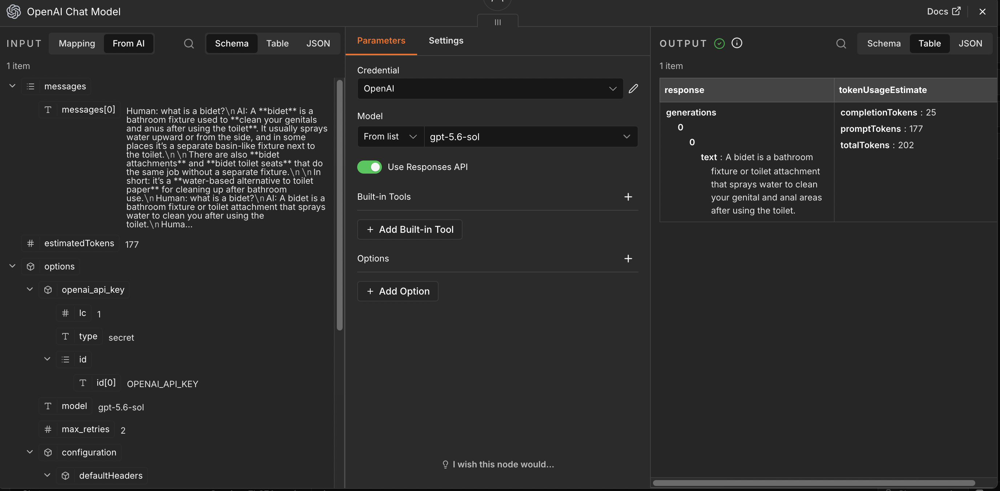
  <figcaption>Sol model run: the OpenAI Chat Model uses <code>gpt-5.6-sol</code> through the Responses API and returns a successful response with token estimates.</figcaption>
</figure>

<figure>
  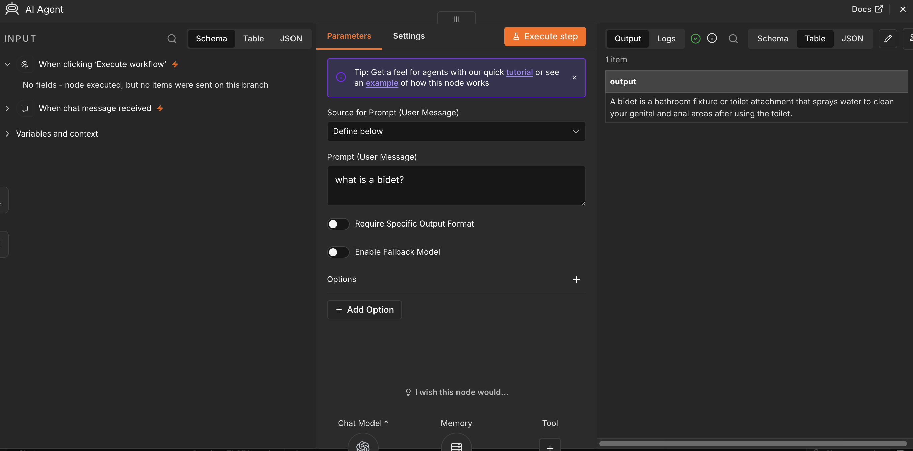
  <figcaption>AI Agent step run: the prompt <code>what is a bidet?</code> returns a successful answer.</figcaption>
</figure>

<figure>
  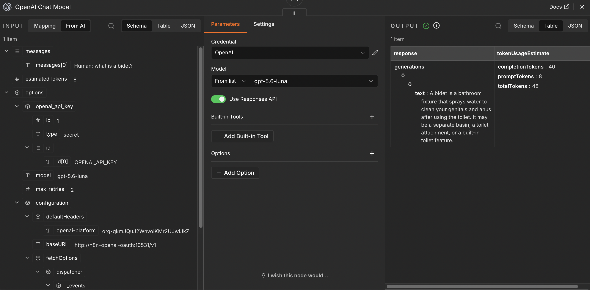
  <figcaption>Luna model run: the OpenAI Chat Model uses <code>gpt-5.6-luna</code> through the Responses API and returns a successful answer with token estimates.</figcaption>
</figure>

<figure>
  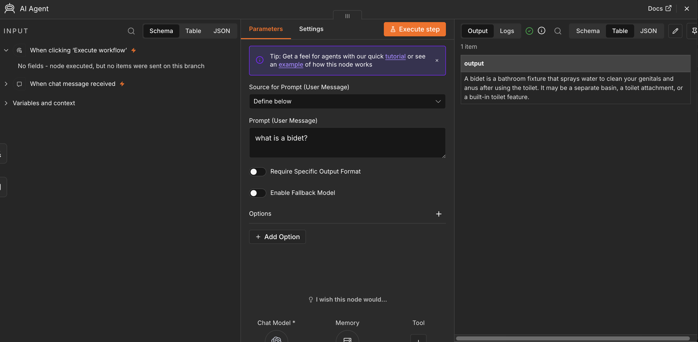
  <figcaption>AI Agent step output: a second successful run of the same bidet prompt using the configured agent workflow.</figcaption>
</figure>

## Hosted ChatGPT site

Try the hosted browser experience at
[relmio.vercel.app](https://relmio.vercel.app/). It provides a separate
ChatGPT sign-in and a small request-bound chat demo; it does not create an
OpenAI Platform API key or replace the local n8n setup wizard.

> [!WARNING]
> **Hosted chat requires the browser extension.** Install the open-source
> [Sign in with ChatGPT extension for Chrome](https://chromewebstore.google.com/detail/sign-in-with-chatgpt/odbgboachaefbbbdiffcefhpkekhfcna)
> or [Firefox](https://addons.mozilla.org/firefox/addon/sign-in-with-chatgpt/)
> before connecting. If the hosted chat stays disconnected, confirm the
> extension is installed and enabled, reload the page, and select **Connect
> ChatGPT** again. The upstream component also shows its install screen when it
> detects that the extension is missing.

> [!NOTE]
> The local npm wizard uses its own `localhost:1455` callback instead. If an
> OAuth extension captures that callback, temporarily disable it during local sign-in,
> complete the wizard sign-in, and then re-enable it.

<figure>
  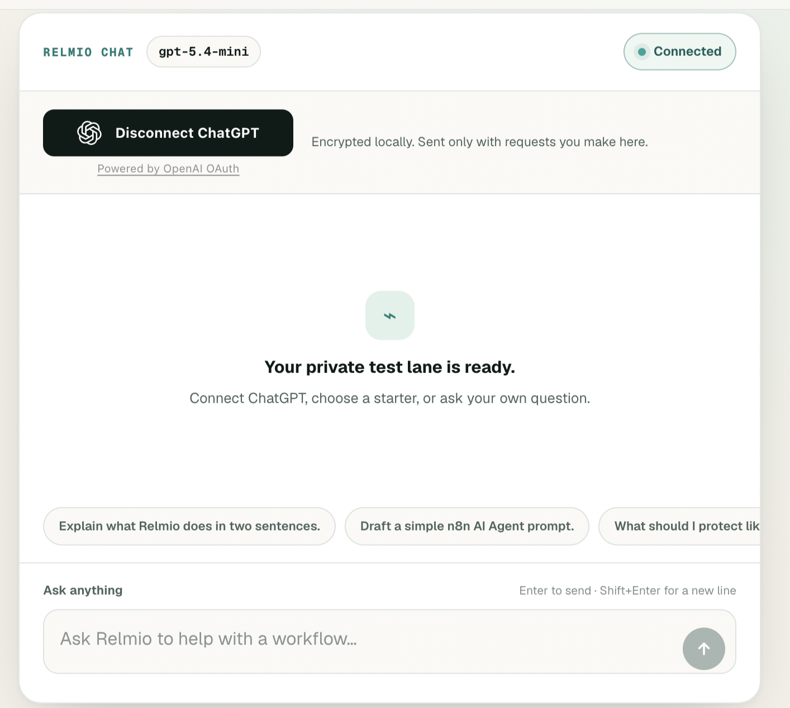
  <figcaption>Successful hosted-chat state: the browser extension completed the OAuth handoff and Relmio shows the ChatGPT session as connected.</figcaption>
</figure>

The site's [Install wizard](https://relmio.vercel.app/install) page provides a
clickable macOS/Linux, Homebrew, PowerShell, Command Prompt, and NPX switcher for the
current self-hosted n8n and Hostinger VPS setup path.

## Browser interface and theme modes

The hosted site and local wizard keep the original Relmio relay layout while
adding a compact **System / Light / Dark** appearance control. System follows
the computer's preference; Light and Dark are remembered on that browser only.
The local wizard keeps its horizontal five-step Signal Spine at the top of the
flow, and the hosted site keeps the live GitHub star/version control visible.
Both surfaces collapse their controls for narrow phone screens without
turning the setup flow into a side rail or requiring a separate mobile app.

## Choose a setup path

Both methods create the same separate sidecar and leave the existing n8n
container, image, Compose file, and workflows alone.

| Path | Best for | What you do |
|---|---|---|
| **Browser wizard** | Most users | Run one curl command, follow guided screens, verify the server identity, review the plan, then approve |
| **Manual setup** | Wizard failures, unusual VPS setups, debugging, and contributors | Run the underlying login, SSH, file, and Docker Compose steps yourself |

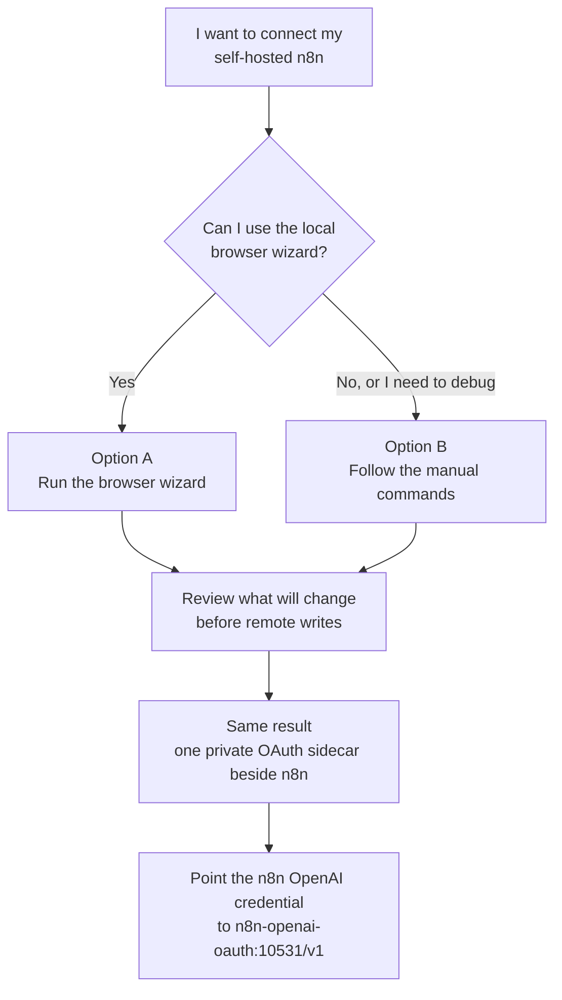
```mermaid
flowchart TD
  Start["I want to connect my<br/>self-hosted n8n"]
  Choice{"Can I use the local<br/>browser wizard?"}
  Wizard["Option A<br/>Run the browser wizard"]
  Manual["Option B<br/>Follow the manual commands"]
  Review["Review what will change<br/>before remote writes"]
  Result["Same result<br/>one private OAuth sidecar beside n8n"]
  Configure["Point the n8n OpenAI credential<br/>to n8n-openai-oauth:10531/v1"]

  Start --> Choice
  Choice -->|"Yes"| Wizard
  Choice -->|"No, or I need to debug"| Manual
  Wizard --> Review
  Manual --> Review
  Review --> Result
  Result --> Configure
```

The wizard is a convenience layer, not a requirement. If it cannot run, or if
you want to inspect, reproduce, improve, or debug the method, use
[Manual setup and debugging](#manual-setup-and-debugging).

## Quick start with the npm package

### Requirements

- A local macOS, Linux, or Windows computer
- On macOS/Linux/WSL/Git Bash: `curl`, `awk`, `tar`, and a SHA-256 tool
  (`sha256sum` or `shasum`); Git Bash also needs `unzip`
- On native Windows: Command Prompt uses its built-in `curl`, `certutil`, and
  `tar` tools; Windows PowerShell 5.1 or PowerShell 7 remains an alternative
  bootstrap
- A browser and a ChatGPT account eligible to use the upstream Codex flow
- A self-hosted n8n Docker container on a VPS
- Docker Engine and Docker Compose v2 on the VPS
- The VPS address, SSH port, and root password
- A Docker network that n8n and the new sidecar can share

> [!WARNING]
> Export or otherwise back up your n8n workflows before using the wizard.
> The wizard is designed to create or update only its separate sidecar and
> does not issue n8n deletion, restart, or rebuild commands, but it still
> authenticates to your VPS and writes files there. Keep a recoverable backup
> before granting it access.

Do **not** run an installer command on the VPS. Run it on the computer where
you will complete the browser sign-in.

### 1. Choose an installation method in the hosted wizard

The hosted installation page starts with a selector for macOS/Linux,
Homebrew, PowerShell, Command Prompt, and NPX. Choose the terminal already
installed on your computer, then run the displayed command locally.

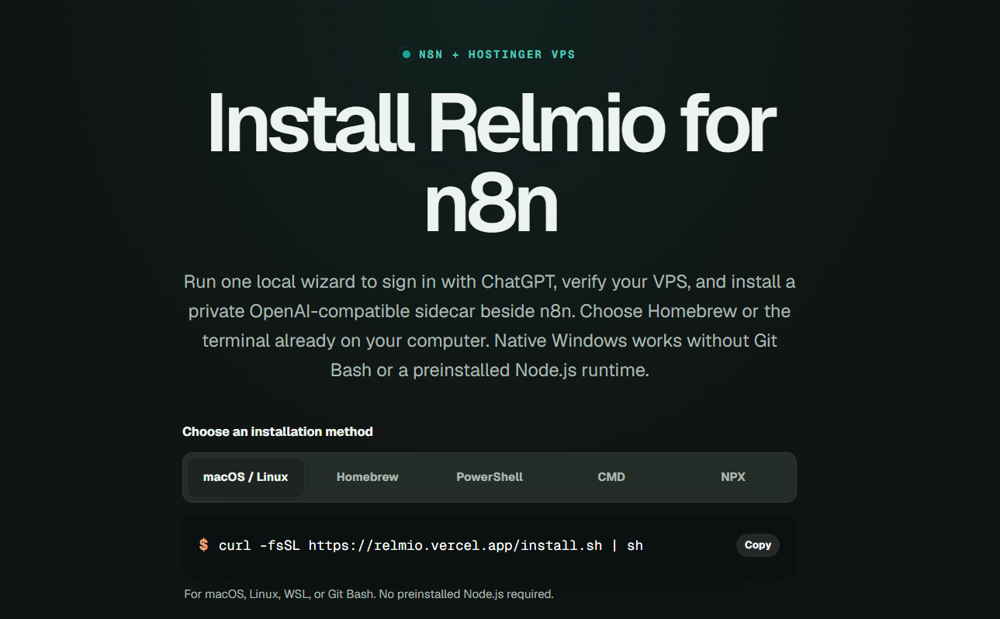

Choose a terminal already installed on your computer.

#### macOS, Linux, WSL, or Git Bash

```bash
curl -fsSL https://relmio.vercel.app/install.sh | sh
```

#### Homebrew (macOS or Linux)

```bash
brew tap Demonbane18/relmio && brew install relmio
```

#### Windows PowerShell

```powershell
irm https://relmio.vercel.app/install.ps1 | iex
```

#### Windows Command Prompt

```bat
for /f "delims=" %F in ("%TEMP%\relmio-install-%RANDOM%-%RANDOM%-%RANDOM%.cmd") do @if exist "%~F" (exit /b 80) else curl -fsSL --remove-on-error https://relmio.vercel.app/install.cmd -o "%~F" && set "RELMIO_SELF_DELETE=%~F" && call "%~F"
```

The POSIX and native Windows bootstraps use a supported Node.js installation
when present. If Node.js is missing or older than 22, they show staged
**Please wait** messages while they download and verify a temporary official
Node.js 22 runtime without installing it system-wide. Native Windows does not
require Git Bash; Command Prompt uses a PowerShell-free, non-admin bootstrap.
Homebrew is available from the public `Demonbane18/relmio` tap. The WinGet
command stays hidden until Microsoft accepts its catalog pull request and the
catalog updates.

Anyone who already has [Node.js 22 or newer](https://nodejs.org/en/download)
can run the npm package directly instead:

#### NPX (requires Node.js 22+)

```bash
npx --yes --ignore-scripts relmio@latest
```

Releases before the rename used the package name
`n8n-openai-oauth-setup`. Package lookup does not redirect automatically, so
update saved commands to `relmio`. The new package still exposes the legacy
executable alias, and existing sidecar directories, service names, hostnames,
and credentials remain compatible.

Keep that terminal open. Each command starts a one-time web server on
`127.0.0.1`, prints a private session URL, and opens the wizard in your
browser. It does not globally install this package.

If the browser does not open automatically, press Enter in an interactive
terminal to open it again. The printed `Local wizard:` URL remains the fallback
for a terminal that cannot accept input or when the launcher still cannot open
a browser.

If the page says the wizard link is incomplete, close that tab and open the
full `Local wizard:` URL printed by the active setup terminal. Do not refresh a
page after its private session token has been removed from the address bar.

To confirm which version npm currently publishes:

```bash
npm view relmio version
```

> [!NOTE]
> These current product screenshots omit or redact sensitive values. In
> particular, the VPS identity screen redacts the address and SSH fingerprint;
> none of the screenshots includes an OAuth token, password, private key, or
> live wizard session URL.

### 2. Complete or reuse the local ChatGPT sign-in

The wizard stores its validated credential at:

```text
~/.n8n-openai-oauth/auth.json
```

It does not reuse or overwrite the Codex app's `~/.codex/auth.json`. If a
credential already exists, **Continue to VPS** reuses it. Use **Refresh
ChatGPT sign-in** when it is expired, belongs to another account, or you want
a new session.

After a fresh login, the browser confirmation states that the ChatGPT
credentials were saved locally; return to the terminal to continue.

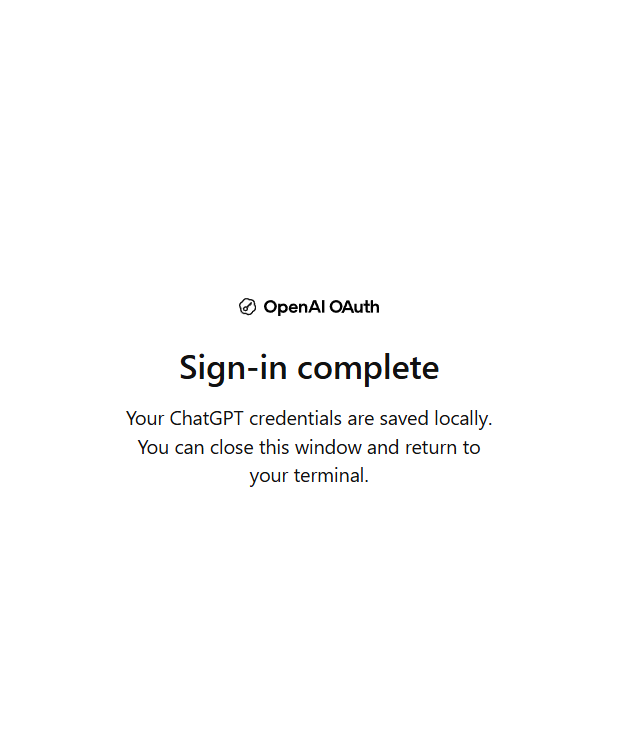

If a browser extension named **Sign in with ChatGPT** or **OpenAI OAuth**
captures the callback, temporarily disable that extension and start the
refresh again from the wizard. The active wizard must receive the callback on
`localhost:1455`.

### 3. Verify the VPS before entering its password

Enter the VPS address exactly as your provider shows it. Select **Check server
identity**, compare the SHA-256 fingerprint with the intended server, and
confirm it before the password field unlocks.

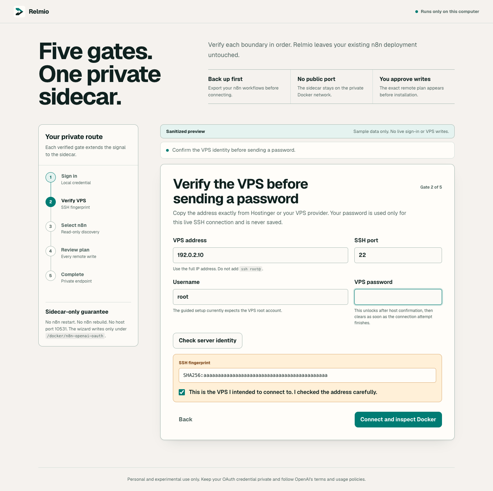

The screenshot redacts the VPS address and SSH fingerprint and obscures the
password field. Never publish a real password, private key, session URL, or
OAuth file.

### 4. Choose the detected n8n container and shared network

The wizard connects over SSH, runs read-only Docker discovery, and lists the
running n8n container and its networks. Choose the network that n8n should
share with the sidecar; on many Hostinger templates it is named `proxy`.

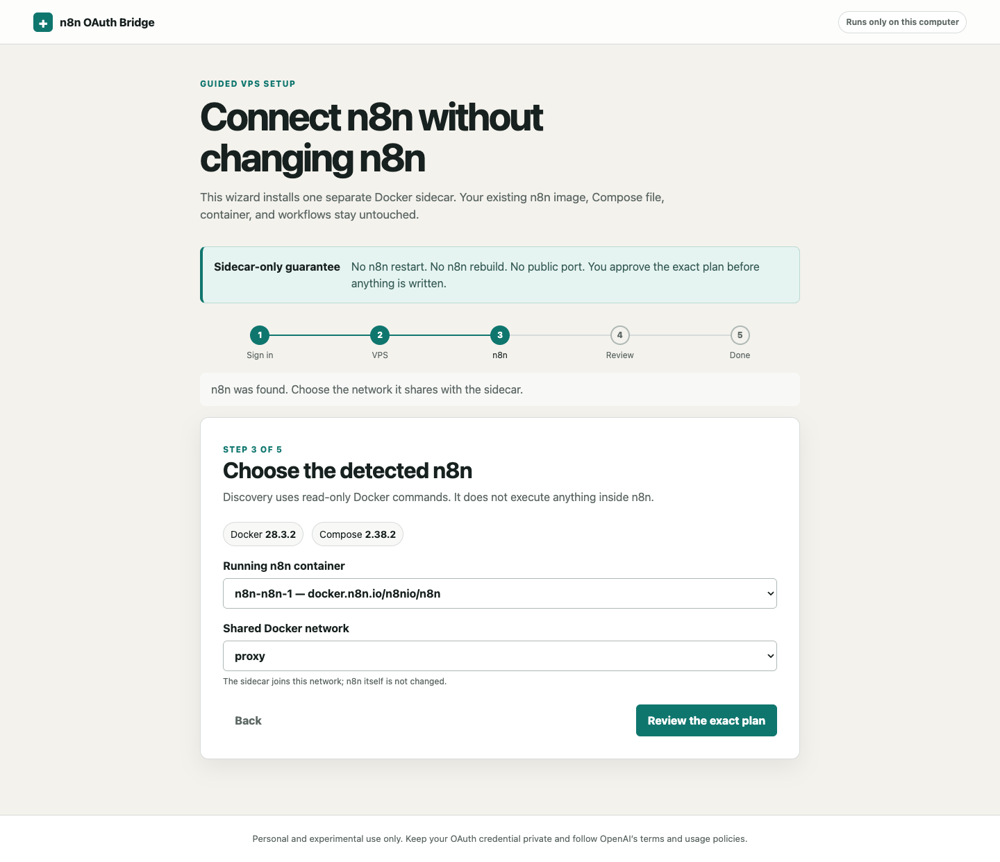

### 5. Review and approve the exact plan

Nothing is written during discovery. The review screen shows the single
managed directory, service, Docker network, and private hostname. It also
states the forbidden actions: no n8n edit, rebuild, restart, or recreation;
no host port; and no Traefik route.

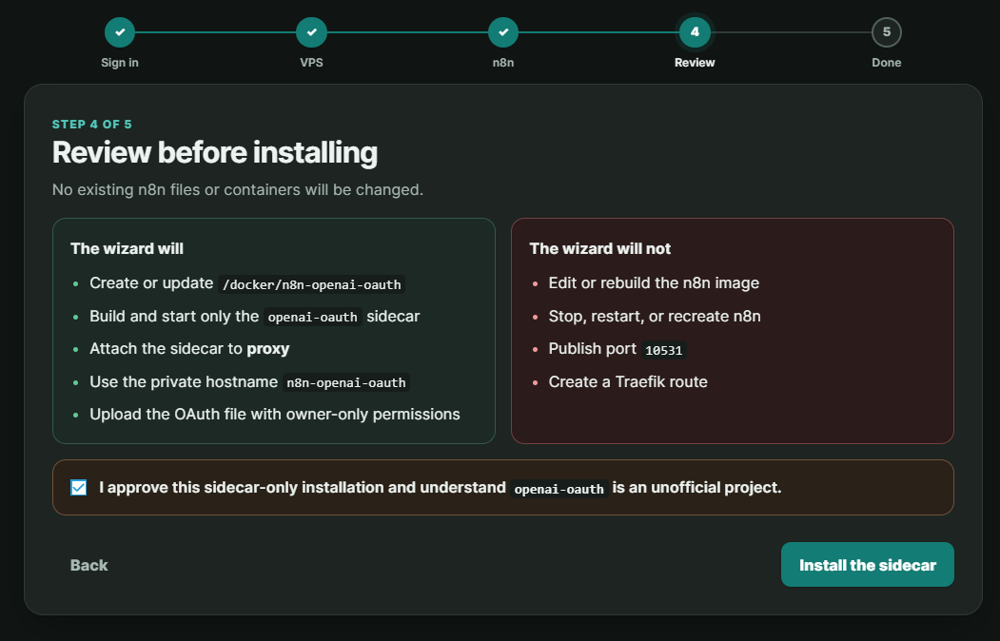

Only after you select the approval checkbox can the wizard upload the OAuth
file and build the separate sidecar.

### 6. Copy the verified settings into n8n

The final screen appears only after the sidecar is healthy, the model list is
reachable, and Docker reports no published host port.

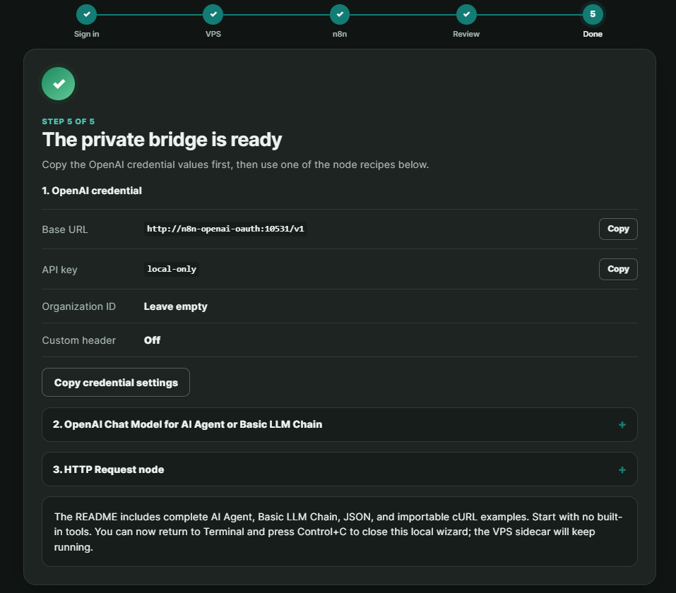

Use the button beside each value to copy it individually, or select
**Copy credential settings** for the labeled credential set. Then create or
edit an **OpenAI** credential in n8n:

**API Key**

```text
local-only
```

**Base URL**

```text
http://n8n-openai-oauth:10531/v1
```

**Organization ID:** leave empty.

**Add Custom Header**

```text
Off
```

For an **OpenAI Chat Model**:

- select one of the models returned by the bridge;
- on Chat Model node version 1.3, keep **Use Responses API** on;
- if that switch is absent, keep the node's default Chat Completions behavior;
- begin with a simple prompt and no built-in tools;
- add tools only after the basic request succeeds.

The bridge supports both `/v1/responses` and `/v1/chat/completions`.

For an **HTTP Request** node, use n8n's **Generic Credential Type** with
**Bearer Auth**. Name the credential `openai-oauth` and enter the harmless
placeholder `local-only` as its bearer token. Use this private endpoint and
enable **Send Headers** and **Send Body**:

```text
POST http://n8n-openai-oauth:10531/v1/chat/completions
Content-Type: application/json
```

Select **JSON** and **Using JSON**, then paste this body (replace only the
model if the wizard reports a different ID):

```json
{
  "model": "gpt-5.6-sol",
  "messages": [
    {
      "role": "user",
      "content": "What is a robot?"
    }
  ],
  "response_format": {
    "type": "json_schema",
    "json_schema": {
      "name": "answer",
      "schema": {
        "type": "object",
        "properties": {
          "content": { "type": "string" }
        },
        "required": ["content"],
        "additionalProperties": false
      },
      "strict": true
    }
  }
}
```

The wizard's **Copy HTTP request recipe** action includes the same fields and
body. The complete guide also includes an importable cURL command. The
`local-only` bearer value is not an OpenAI Platform API key or secret.

For complete copy-paste recipes for an **AI Agent**, **Basic LLM Chain**, and
**HTTP Request** node, including an importable cURL command, open
[Configure n8n nodes](docs/n8n-configuration.md).

## Run from a repository clone

The curl command above is the recommended path. Contributors can instead run
the source checkout:

```bash
git clone https://github.com/Demonbane18/relmio.git
cd relmio
npm ci --ignore-scripts
npm start
```

On macOS, **Start Wizard.command** performs the install-and-start steps. On
Windows, use **Start Wizard.bat**.

## Manual setup and debugging

The manual method is intentionally supported. It is the fallback when the npm
wizard does not work, and it exposes every underlying step so technical users
can reproduce problems and contribute fixes. It creates the same separate
sidecar; it does not modify the existing n8n Compose project.

You need a POSIX shell (macOS, Linux, WSL, or Git Bash), Node.js 22 or newer,
SSH access to the VPS, Docker Compose v2 on the VPS, and the name of a Docker
network already used by n8n. Back up your n8n workflows before starting.

> [!CAUTION]
> Manual commands do not provide the wizard's validation guardrails. Check
> every replacement value, verify the SSH host fingerprint before entering a
> password, never print the OAuth file, and stop for a final review before the
> first remote write in step 3.

### 1. Create the OAuth file on your computer

Run this on your own computer, not on the VPS:

```bash
install -d -m 0700 "$HOME/.n8n-openai-oauth"
npx --yes --ignore-scripts openai-oauth@2.0.0 login \
  --open \
  --login-timeout-ms 300000 \
  --oauth-file "$HOME/.n8n-openai-oauth/auth.json"
test -s "$HOME/.n8n-openai-oauth/auth.json" \
  && echo "OAuth file is ready"
```

Complete the browser sign-in opened by the newest command. The dedicated file
does not reuse or overwrite `~/.codex/auth.json`. Treat both files like
passwords.

### 2. Verify and inspect the VPS

Connect from your computer:

```bash
ssh root@YOUR_VPS_IP
```

On the first connection, compare the displayed SSH fingerprint with the one
from your VPS provider before accepting it. Then list the containers:

```bash
docker ps --format 'table {{.Names}}\t{{.Image}}\t{{.Ports}}'
```

Find the container using the official n8n image and inspect its networks,
replacing `n8n-n8n-1` with its actual container name:

```bash
docker inspect n8n-n8n-1 --format '{{range $name, $_ := .NetworkSettings.Networks}}{{println $name}}{{end}}'
```

Record one existing network name that the new sidecar can share with n8n. It
is commonly `proxy`, but use the name returned by your own VPS.

### 3. Review, then create only the sidecar directory

Before continuing, confirm all three facts:

- the SSH fingerprint belongs to the intended VPS;
- the selected container is your existing n8n container;
- the selected Docker network is already attached to that n8n container.

Only after that final human review, create the separate directories:

```bash
install -d -m 0755 /docker/n8n-openai-oauth
install -d -m 0700 -o 1000 -g 1000 /docker/n8n-openai-oauth/auth
```

Create `/docker/n8n-openai-oauth/Dockerfile` with exactly:

```dockerfile
FROM node:22-bookworm-slim

RUN npm install --global --ignore-scripts openai-oauth@2.0.0 \
    && npm cache clean --force

USER node

ENTRYPOINT ["openai-oauth"]
CMD ["--host", "0.0.0.0", "--port", "10531", "--oauth-file", "/home/node/.codex/auth.json"]
```

Create `/docker/n8n-openai-oauth/docker-compose.yml` with exactly the following.
If the chosen network is not `proxy`, change only the final `name: proxy` line.

```yaml
services:
  openai-oauth:
    build:
      context: .
      dockerfile: Dockerfile
    restart: unless-stopped
    init: true
    volumes:
      - ./auth:/home/node/.codex
    expose:
      - "10531"
    networks:
      n8n-shared:
        aliases:
          - n8n-openai-oauth
    security_opt:
      - no-new-privileges:true
    cap_drop:
      - ALL
    read_only: true
    tmpfs:
      - /tmp:size=16m,mode=1777
      - /home/node/.local:uid=1000,gid=1000,mode=0700
    pids_limit: 128
    mem_limit: 512m
    cpus: 1.0
    healthcheck:
      test:
        - CMD
        - node
        - -e
        - 'fetch("http://127.0.0.1:10531/health").then((response) => process.exit(response.ok ? 0 : 1)).catch(() => process.exit(1))'
      interval: 30s
      timeout: 5s
      retries: 3
      start_period: 20s
    labels:
      io.n8n-openai-oauth.managed: "true"

networks:
  n8n-shared:
    external: true
    name: proxy
```

There is deliberately no `ports:` section and no Traefik label.

### 4. Copy the protected OAuth file

Leave the VPS shell:

```bash
exit
```

Run `scp` on your own computer:

```bash
scp "$HOME/.n8n-openai-oauth/auth.json" \
  root@YOUR_VPS_IP:/docker/n8n-openai-oauth/auth/auth.json
```

Reconnect and apply owner-only permissions on the VPS:

```bash
ssh root@YOUR_VPS_IP
chown 1000:1000 /docker/n8n-openai-oauth/auth/auth.json
chmod 600 /docker/n8n-openai-oauth/auth/auth.json
```

### 5. Validate, build, and start only the sidecar

Use the explicit Compose project and file on every command:

```bash
docker compose \
  --project-name n8n-openai-oauth \
  --file /docker/n8n-openai-oauth/docker-compose.yml \
  config --quiet

docker compose \
  --project-name n8n-openai-oauth \
  --file /docker/n8n-openai-oauth/docker-compose.yml \
  build openai-oauth

docker compose \
  --project-name n8n-openai-oauth \
  --file /docker/n8n-openai-oauth/docker-compose.yml \
  up -d --wait --wait-timeout 60 --no-deps openai-oauth
```

These commands name only the separate `openai-oauth` service. They do not
reference the existing n8n Compose file or service.

### 6. Verify the private bridge

Check its final logs:

```bash
docker compose \
  --project-name n8n-openai-oauth \
  --file /docker/n8n-openai-oauth/docker-compose.yml \
  logs --tail=50 openai-oauth
```

Prove that port `10531` is not published on the VPS:

```bash
docker compose \
  --project-name n8n-openai-oauth \
  --file /docker/n8n-openai-oauth/docker-compose.yml \
  port openai-oauth 10531
```

Success is no output. Then verify the model endpoint from inside the sidecar:

```bash
docker compose \
  --project-name n8n-openai-oauth \
  --file /docker/n8n-openai-oauth/docker-compose.yml \
  exec -T openai-oauth \
  node -e 'fetch("http://127.0.0.1:10531/v1/models").then(async (response) => { console.log(await response.text()); process.exit(response.ok ? 0 : 1); }).catch(() => process.exit(1))'
```

### 7. Configure n8n

Use the same credential settings as the wizard:

```text
API Key: local-only
Organization ID: leave empty
Base URL: http://n8n-openai-oauth:10531/v1
Add Custom Header: off
```

Do not use `127.0.0.1` in n8n; inside its container, that address means n8n
itself. For more explanations, common shell mistakes, and expected output, see
the [expanded beginner manual installation guide](docs/manual-install.md).

## How it works behind the scenes

OpenAI's Codex CLI uses authenticated endpoints at
`chatgpt.com/backend-api/codex` to run models with a ChatGPT account. By using
the same OAuth credential shape as Codex through the upstream
[`openai-oauth`](https://github.com/EvanZhouDev/openai-oauth) helper, Relmio can
provide an OpenAI-compatible interface without asking users to buy separate
OpenAI Platform API credits. The exact upstream behavior, supported models,
and access rules can change.

### Foundation and attribution

Relmio's core sign-in and upstream request path are built on the
[`openai-oauth`](https://github.com/EvanZhouDev/openai-oauth) project by Evan
Zhou Dev. The upstream project provides an SDK/helper for integrating ChatGPT
login into local apps and enabling Sign in with ChatGPT flows. Relmio uses
that foundation for its private OAuth sidecar, then adds n8n discovery,
verified SSH/SFTP deployment, Docker networking, and OpenAI-compatible
configuration around it. The upstream project remains separately maintained;
review its README, license, and notices for its own terms and behavior.

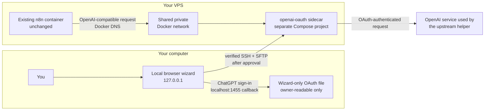
```mermaid
flowchart LR
  subgraph Local["Your computer"]
    U["You"]
    B["Local browser wizard<br/>127.0.0.1"]
    A["Wizard-only OAuth file<br/>owner-readable only"]
    U --> B
    B -->|"ChatGPT sign-in<br/>localhost:1455 callback"| A
  end

  subgraph VPS["Your VPS"]
    N["Existing n8n container<br/>unchanged"]
    S["openai-oauth sidecar<br/>separate Compose project"]
    D["Shared private<br/>Docker network"]
    N -->|"OpenAI-compatible request<br/>Docker DNS"| D
    D --> S
  end

  B -->|"verified SSH + SFTP<br/>after approval"| S
  S -->|"OAuth-authenticated request"| O["OpenAI service used by<br/>the upstream helper"]
```

The design works because four independent features line up:

1. n8n's OpenAI credential accepts a custom Base URL.
2. `openai-oauth` exposes OpenAI-compatible routes such as `/v1/models`,
   `/v1/responses`, and `/v1/chat/completions`.
3. Docker DNS lets n8n reach the sidecar by the private hostname
   `n8n-openai-oauth` on a shared network.
4. The upstream helper uses the mounted OAuth credential for its upstream
   authentication, while n8n sends the harmless `local-only` placeholder.

The request flow after installation is:

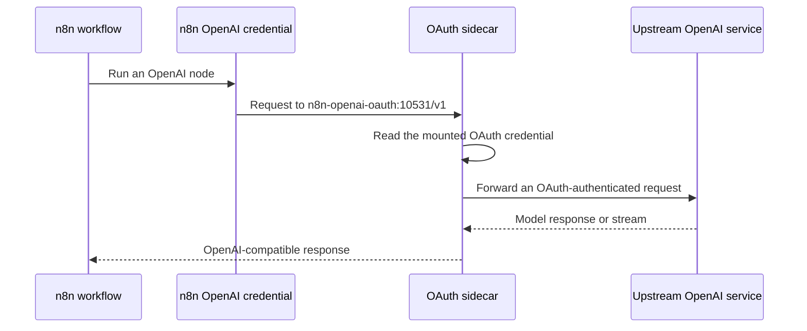
```mermaid
sequenceDiagram
  participant W as n8n workflow
  participant C as n8n OpenAI credential
  participant S as OAuth sidecar
  participant O as Upstream OpenAI service

  W->>C: Run an OpenAI node
  C->>S: Request to n8n-openai-oauth:10531/v1
  S->>S: Read the mounted OAuth credential
  S->>O: Forward an OAuth-authenticated request
  O-->>S: Model response or stream
  S-->>W: OpenAI-compatible response
```

See [Architecture and n8n safety boundary](docs/architecture.md) for the
mutation boundary and command-level design.

## What the wizard can and cannot change

The wizard:

- reads the running n8n container and networks with read-only Docker commands;
- writes only under `/docker/n8n-openai-oauth`;
- creates a separate Compose project named `n8n-openai-oauth`;
- builds and starts only the `openai-oauth` service;
- uploads the OAuth file through SFTP with owner-only permissions;
- joins an existing Docker network;
- verifies that port `10531` is not published.

It never edits the n8n Compose file or image and never builds, restarts, stops,
recreates, or removes the n8n container. It also creates no Traefik route.
Automated tests enforce this boundary.

## Refresh, update, and remove

To refresh an expired ChatGPT session, open the
[install page](https://relmio.vercel.app/install), run the command for your
terminal again, choose **Refresh ChatGPT sign-in**, verify the timestamp, and
approve the update to the same wizard-managed sidecar. For example, on
macOS/Linux:

```bash
curl -fsSL https://relmio.vercel.app/install.sh | sh
```

The update targets only the sidecar. It does not restart n8n. For rollback,
recoverable uninstall, and pinned upstream upgrades, follow
[Refresh, upgrade, rollback, and uninstall](docs/maintenance.md).

## Troubleshooting first steps

- **Old wizard version:** close the old terminal and run the `@latest` command.
- **Browser did not open:** copy the newest printed `127.0.0.1` URL into the
  browser while its terminal remains open.
- **Sign-in says expired:** close the old OAuth tab and begin a fresh refresh
  from the active wizard.
- **Extension page appears:** temporarily disable the extension that captured
  `localhost:1455`.
- **SSH fails:** recheck the full address, port, root password, provider
  firewall, and confirmed fingerprint.
- **n8n cannot connect:** use
  `http://n8n-openai-oauth:10531/v1`, never `127.0.0.1`.

See the full symptom matrix in [Troubleshooting](docs/troubleshooting.md).

## Release and version synchronization

`package.json` is the release version source of truth. The repository also
keeps these values synchronized:

- `package-lock.json` package and root-package versions;
- the newest version heading in [CHANGELOG.md](CHANGELOG.md);
- the Git tag `v<version>` for tagged builds.

`npm run release:check` rejects a mismatch among those local release files
and, on a tag build, the Git tag. The npm badge is an informational view of
the registry's cached `latest` version; the maintainer guide performs a
separate post-publish equality check against the registry. Maintainers must
bump and commit the repository version before publishing that same immutable
version to npm. Publishing npm first does not automatically rewrite Git
history or the README. Follow the
[npm maintainer publishing guide](docs/npm-publish.md) for the ordered release
procedure.

## Documentation

- [Brand name, mark, and compatibility identifiers](docs/brand.md)
- [Changelog](CHANGELOG.md)
- [Troubleshooting](docs/troubleshooting.md)
- [OpenAI credential and node recipes](docs/n8n-configuration.md)
- [Beginner manual installation](docs/manual-install.md)
- [Security and limitations](docs/security.md)
- [Architecture and n8n safety boundary](docs/architecture.md)
- [Refresh, upgrade, rollback, and uninstall](docs/maintenance.md)
- [YouTube walkthrough outline](docs/video-outline.md)
- [npm maintainer publishing guide](docs/npm-publish.md)
- [Contributing](CONTRIBUTING.md)
- [Approved scope](SPEC.md)

## Supported bridge behavior

The pinned upstream `2.0.0` release documents:

- `/v1/models`;
- `/v1/responses`;
- `/v1/chat/completions`;
- streaming and tool calls.

Available models depend on the ChatGPT account and may change. The upstream
Responses implementation is stateless, so callers must send the conversation
history needed for each request.

## Known limitations

What is intentionally not there yet:

- Only models supported by Codex are available. This list updates over time
  and depends on your ChatGPT plan.
- There is no stateful replay support on the CLI `/v1/responses` endpoint. The
  proxy is stateless and expects callers to send the full conversation history.
- Hosted browser sign-in currently supports Chrome and Firefox. Safari is not
  yet supported by the upstream Sign in with ChatGPT flow.

## Legal

Relmio and the upstream `openai-oauth` project are unofficial,
community-maintained projects. They are not affiliated with, endorsed by, or
sponsored by OpenAI.

OpenAI OAuth uses ChatGPT credentials, which should be treated like passwords.
Each person must use their own ChatGPT account and keep credentials private. Do
not pool, share, or redistribute access tokens. Apps offering Sign in with
ChatGPT must protect each user's credentials and use them only for requests
that user authorizes.

You are responsible for complying with OpenAI's [Terms of
Use](https://openai.com/policies/terms-of-use/), [Usage
Policies](https://openai.com/policies/usage-policies/), and any agreement that
applies to your account. Do not bypass rate limits, restrictions, or safeguards.

This project is provided as-is without warranties. OpenAI may change or
disable the underlying services at any time, and you assume the risks of using
it.

## Contributing

Pull requests and focused issue reports are welcome. Before opening a PR,
please read [CONTRIBUTING.md](CONTRIBUTING.md), run the local checks, and keep
the change scoped to one improvement. Never commit OAuth files, passwords,
private keys, live session URLs, real VPS addresses, or screenshots containing
account or infrastructure details.

<p>
  <a href="CONTRIBUTING.md">Contribution guide</a>
  &nbsp;·&nbsp;
  <a href="https://github.com/Demonbane18/relmio/compare">Submit a pull request</a>
  &nbsp;·&nbsp;
  <a href="https://github.com/Demonbane18/relmio/issues/new">Open an issue</a>
</p>

## Security and responsible disclosure

Please use the private reporting path described in
[Security and limitations](docs/security.md) for suspected vulnerabilities.
Do not publish credentials, OAuth material, host details, or an exploit in a
public issue.

If this project saves you time, please consider [starring the repository](https://github.com/Demonbane18/relmio/stargazers).

## Sources and further reading

- [`openai-oauth` v2.0.0 release](https://github.com/EvanZhouDev/openai-oauth/releases/tag/v2.0.0)
- [`openai-oauth` v2.0.0 server routes](https://github.com/EvanZhouDev/openai-oauth/blob/v2.0.0/packages/openai-oauth/src/server.ts)
- [`openai-oauth` v2.0.0 login flow](https://github.com/EvanZhouDev/openai-oauth/blob/v2.0.0/packages/openai-oauth/src/login.ts)
- [n8n OpenAI credential documentation](https://docs.n8n.io/integrations/builtin/credentials/openai/)
- [n8n OpenAI credential source](https://github.com/n8n-io/n8n/blob/master/packages/nodes-base/credentials/OpenAiApi.credentials.ts)
- [n8n OpenAI Chat Model source](https://github.com/n8n-io/n8n/blob/master/packages/%40n8n/nodes-langchain/nodes/llms/LMChatOpenAi/LmChatOpenAi.node.ts)
- [Docker Compose networking](https://docs.docker.com/compose/how-tos/networking/)
- [Docker Compose `expose`](https://docs.docker.com/reference/compose-file/services/#expose)
- [Docker port publishing](https://docs.docker.com/engine/network/port-publishing/)
- [OpenAI: using Codex with a ChatGPT plan](https://help.openai.com/en/articles/11369540-using-codex-with-your-chatgpt-plan)
- [OpenAI Terms of Use](https://openai.com/policies/terms-of-use/)
- [npm semantic versioning](https://docs.npmjs.com/about-semantic-versioning/)

## License

[Apache License 2.0](LICENSE). Relmio's [NOTICE](NOTICE) preserves the
upstream `openai-oauth` attribution; review both projects' notices before
distributing or deploying this setup.
