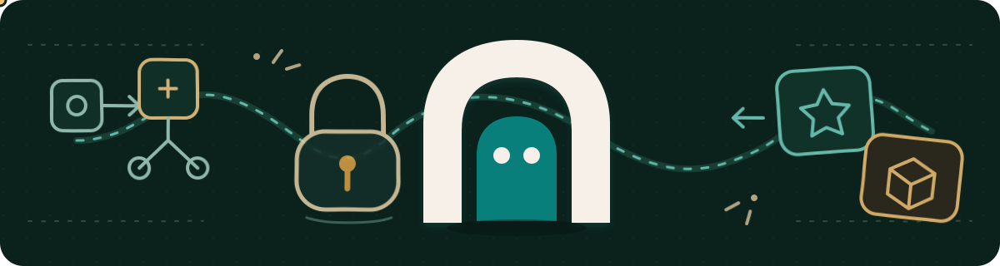

<p align="center">
  
</p>

<h1 align="center">Relmio</h1>

<p align="center"><strong>Bring your AI sign-ins to your tools. Keep every credential where it belongs.</strong></p>

<p align="center">
  <a href="https://www.npmjs.com/package/relmio"></a>
  <a href="https://www.npmjs.com/package/relmio"></a>
  <a href="https://github.com/Demonbane18/relmio/stargazers"></a>
  <a href="https://github.com/Demonbane18/relmio/actions/workflows/ci.yml"></a>
  <a href="LICENSE"></a>
</p>

Relmio helps self-hosted n8n and local apps use models through your own
ChatGPT/Codex or SuperGrok sign-in. Each provider keeps its own private OAuth
session. SuperGrok setup does not require or read ChatGPT credentials.

Relmio handles provider OAuth only. API-key connections belong directly
in n8n or the client that uses them.
ChatGPT sign-in is not an OpenAI Platform API key.

The hosted chat keeps partial response text visible while it streams. Its
status distinguishes connection setup, waiting for the first words, active
streaming, completion, interruption, and failure without announcing every
token to assistive technology. **Stop response** preserves text already
received, and reduced-motion preferences keep the same state cues without
animation.

SuperGrok is a first-class local and VPS setup option in 0.14.0, but the adapter
remains experimental. Live Windows checks covered fresh sign-in, model discovery,
n8n Chat, Assistant node search, and a Calculator workflow. The full Windows gate
remains conditional because Git Bash 2.38.1 needs the per-process terminal setting
described below. VPS Chat success was user-reported after Responses API was turned
off; VPS Assistant and Calculator remain unverified.

Existing API-key endpoints are left running and retain their data during an
upgrade; they are no longer shown in the 0.15.0 dashboard. Follow the
[legacy endpoint retirement guide](https://relmio.vercel.app/docs/local-endpoints#retired-api-installations)
to review and stop an exact owned endpoint.

## Quick install

With Node.js 24 or newer on macOS, Linux, WSL, Git Bash, Windows PowerShell,
or Command Prompt:

```bash
npx --yes --ignore-scripts relmio@latest
```

Git Bash 2.38.1 does not give the portable launcher the native child TTY it
needs under its default mintty setup. Use `MSYS=enable_pcon` for this process,
or run the native PowerShell or Command Prompt installer instead:

```bash
MSYS=enable_pcon npx --yes --ignore-scripts relmio@latest
```

This does not change global Git configuration. An upgraded Git Bash version
has not been verified by the 0.14.0 acceptance run.

The command opens a private dashboard on `127.0.0.1` and rediscovers services
Relmio already manages. Select **Add connection** to open the four-step wizard,
review exactly what it will create, then confirm the install.

No Node.js yet? The hosted guide has native curl, Homebrew, PowerShell, and
Command Prompt options. Homebrew installs the persistent `relmio` command; it
does not launch the browser. The curl, PowerShell, and Command Prompt
launchers open the foreground wizard with the same platform security checks.

[Open the hosted install guide](https://relmio.vercel.app/install)

## Keep the local dashboard available

For a persistent command, install Relmio with Node.js 24 or newer, then manage
its owner-scoped loopback dashboard explicitly:

```bash
npm install --global --ignore-scripts relmio@latest
relmio start
relmio status
relmio open
relmio stop
```

Without a global install, repeat the full NPX command for each lifecycle
action:

```bash
npx --yes --ignore-scripts relmio@latest start
npx --yes --ignore-scripts relmio@latest status
npx --yes --ignore-scripts relmio@latest open
npx --yes --ignore-scripts relmio@latest stop
```

`relmio start` runs the dashboard in the background without opening a browser.
`relmio open` starts it when needed and opens its private local page.
`relmio status` checks only the verified dashboard process without printing a
session value. `relmio stop` stops only that process; it does not stop or
restart n8n, ngrok, model endpoints, bridges, Assistant companions, or
unrelated containers.

The hosted curl, PowerShell, and Command Prompt launchers can use a verified
temporary Node.js runtime. In that mode Relmio remains a foreground, one-shot
process for that terminal and leaves no persistent command behind.

## Upgrade from 0.13.0 and update existing bridges

After installing 0.15.0, run `relmio stop`, then `relmio start` or `relmio
open`. Relmio never reuses a dashboard from another version. The upgrade leaves
existing API-key gateway containers and credential volumes untouched, and the
0.15.0 dashboard does not manage them. It also refuses to adopt an earlier
SuperGrok development install that lacks the fresh-session marker; review that
installation before removal or migration.

Installing a newer Relmio package does not update an OpenAI bridge that is
already running. After installing a Relmio release that contains the latest
bridge compatibility fix, open the dashboard and update the owned bridge:

- For a local n8n bridge, refresh status, select **OpenAI OAuth bridge**, choose
  **Manage bridge**, read the runtime update summary, select its confirmation
  checkbox, then choose **Update bridge runtime**. This keeps the existing
  ChatGPT sign-in, Docker network, and bridge identity.
- For a VPS bridge, run `relmio vps`, reconnect, verify the SSH host fingerprint,
  and select the n8n container and network. Choose **OpenAI-OAuth/Codex bridge**,
  then **Manage OpenAI-OAuth/Codex bridge** and **Review bridge update**. Review
  the plan, select its confirmation checkbox, then choose **Update the bridge**.

Both actions recreate only Relmio's owned sidecar. The local runtime update
keeps its saved sign-in. The VPS update uploads the current local sign-in. They
do not edit, restart, or recreate n8n, and they do not publish port `10531`.
The VPS wizard performs the SSH update from the browser flow, so no separate
VPS terminal is required. Use **Apply sign-in to owned bridge** only when the
local bridge needs a newer ChatGPT sign-in; that action does not update the
bridge runtime.

**Refresh status** rediscovers the seven services in Relmio 0.15.0:
Codex App Server, Codex Chat Adapter, Grok Build, the owned n8n stack, the
ChatGPT OAuth bridge, AI Assistant tools, and SuperGrok for n8n.
Refresh status shows only verified connection URLs and state, never stored
secrets. Select **Add connection** to use the existing four-step setup flow.
Use `relmio vps` when you want to open the separate VPS setup directly.

Choose **Set up SuperGrok for n8n** in the VPS wizard to add
the same private Grok OAuth companion to an existing remote n8n. Review the exact
plan before installation, then complete official device sign-in in your browser.
See [SuperGrok on a VPS](docs/vps-supergrok.md) for Chat Completions settings and
ownership-safe management. No existing n8n restart or provider change is required.

[Learn how to use the local dashboard](docs/local-dashboard.md)

## Pick a path

### I already run n8n

Pick the connection that matches the provider account. The Responses API switch
is provider-specific:

| Connection | Base URL | Value for n8n's API-key field | Use Responses API |
| --- | --- | --- | --- |
| OpenAI OAuth with ChatGPT/Codex sign-in | `http://n8n-openai-oauth:10531/v1` | `local-only` placeholder | **On** in the Relmio OpenAI Chat Model v1.3 recipe |
| SuperGrok OAuth | `http://n8n-supergrok:14502/v1` | One-time local Relmio bearer | **Off** for workflow model nodes and Chat Hub |

Choose **ChatGPT for n8n**. Other local tools are available under **More connections and tools**.

1. Sign in with your own ChatGPT/Codex account.
2. Select the running n8n container and its private Docker network.
3. Review and install the sidecar.
4. In n8n, use `http://n8n-openai-oauth:10531/v1` with the placeholder API key
   `local-only`.

**GPT Image 2.5.** New bridge installations include Flare and Sunburst in model
discovery. For an existing owned bridge, use its browser **Update bridge runtime**
action (local) or **Review bridge update** action (VPS) to receive the new catalog.
In n8n's OpenAI node, choose **Image**, then **Generate an Image** or **Edit Image**.
Select `gpt-image-2.5-flare` or `gpt-image-2.5-sunburst` from the model list; use
**By ID** if your n8n version does not list it. `gpt-image-2` remains available.
The generic `gpt-image-2.5` name is not a request ID. Start with low quality;
exact output dimensions and every image option are not verified. Model discovery
does not guarantee access for every account. Image models are separate from
text chat, GPT-Live, Realtime, and audio support.

**Current ChatGPT bridge limits.** OpenAI audio/TTS, transcription, and
translation are unavailable through Relmio's current ChatGPT sign-in bridge in
both local and VPS n8n. The OpenAI Audio API requires a separate API-key
connection. Do not enter that API key into this OAuth bridge; refreshing your
ChatGPT sign-in will not add audio support.

The current bridge also does not support n8n's **Classify Text for Violations**
action (Moderation API), file upload/list/delete, stored conversation
create/get/update/delete, or video generation. See the full
[n8n capability table](docs/n8n-configuration.md#3-openai-node-v2-capability-audit).

Relmio does not edit, restart, rebuild, or expose n8n. The bridge is unofficial,
private, experimental, and policy-uncertain. Check the rules that apply to your
account before using it.

**Credential and data path.** The local bridge copies the complete ChatGPT/Codex
credential JSON into a private named Docker volume for the third-party pinned
`openai-oauth` package. The VPS bridge transfers the same file by SFTP to the
deployment's `auth` bind mount. n8n sends supported prompts, messages, tool
data, and inline inputs through that package to OpenAI. Building the sidecar
contacts the npm registry to install the pinned package. The one-shot local
credential-seed helper disables Docker logging; the main sidecar has no
explicit Docker log-driver setting. Do not treat any of this as a supported
Sign in with ChatGPT integration, scope grant, Platform API permission, Terms
approval, or model/TTS entitlement.

[Read the existing n8n guide](https://relmio.vercel.app/docs/local-endpoints#self-hosted-n8n-bridge)

For SuperGrok, choose **SuperGrok for n8n**, select
its container and network, then review the private installation. Copy the
one-time Relmio client credential and use `http://n8n-supergrok:14502/v1`.
`grok-build` remains a legacy routing alias; use a freshly discovered model
where the n8n control supports it. Then run:

```sh
relmio grok login --n8n
```

Approve the official device sign-in. The credential entered in n8n's API key
field authorizes access to Relmio only; it is not an xAI API key. For workflow
model nodes, turn **Use Responses API** off and choose **From list**. For Chat
Hub, turn it off in **Settings > Chat > OpenAI > Edit provider**. The Assistant
custom endpoint uses a discovered model name in its text field; it is separate
from the Chat setting. An earlier development install without the fresh-session
marker is not upgraded automatically; migration requires a separately reviewed
path. Sign out with `relmio grok logout --n8n`. This
companion publishes no host port.

### I do not have n8n yet

Choose **Set up new n8n**. Relmio creates a separate n8n stack and walks
you through the ngrok domain, token, and Basic Auth fields. Only the new n8n
route is public. Its model bridge, Code Sandbox, and optional SearXNG stay off
the host network.

[Read the new n8n guide](https://relmio.vercel.app/docs/local-n8n-stack)

### I want to use SuperGrok

The experimental **SuperGrok** adapter uses official OAuth with your eligible
subscription. Local apps and n8n use `/v1/chat/completions` and a separate
local Relmio bearer. The current account catalog listed `grok-4.6` and
`grok-4.5`; discovery is not per-model tool proof. Explicit `grok-4.6` passed
the n8n Assistant node-catalog tool and a Calculator workflow (`317 × 29 =
9193`). `grok-build` remains a legacy alias, not a claim that every request
uses Grok 4.6. Existing n8n is never reconfigured or restarted by this setup.
No xAI API key is requested.

After installing the local SuperGrok endpoint, sign in:

```sh
relmio grok login
```

Approve the displayed code on the official provider page. To sign out later,
run `relmio grok logout`. These commands act only on the attested Relmio runtime.

[Read the SuperGrok guide](https://relmio.vercel.app/docs/local-endpoints#supergrok-development-backends)

## n8n AI Assistant tools

Choose **n8n AI Assistant tools** in the local browser wizard to add Code
Sandbox beside an existing n8n container. SearXNG web search is optional and
off by default. Relmio shows the sandbox key and n8n settings once. It does not
change or restart n8n.

Configure the Assistant's supported model connection directly in n8n. The privileged local runner is for
development and testing; n8n recommends Daytona for production.

[Read the AI Assistant guide](https://relmio.vercel.app/docs/ai-assistant)

## Codex device sign-in

The **Codex App Server** and **Codex Chat Adapter** options use the official
Codex device-code sign-in. The ChatGPT credential stays inside the isolated
Codex container. These experimental routes are for trusted local apps and
development backends, not browsers or public servers.

## Provider account policy

Relmio's Codex targets use the official Codex App Server. Codex owns the
ChatGPT OAuth flow, credential storage, and refresh. Each target has one active
ChatGPT account; changing it requires an explicit sign-out and new sign-in.

Relmio 0.15.0 does not configure upstream API keys, maintain API-key profiles,
or fall back to separately billed API access.

The experimental SuperGrok adapter uses the pinned official Grok CLI for fresh
OAuth/device sign-in and sign-out in its own private volume. The direct HTTP
handler reads only that runtime's marked session to call xAI's documented CLI
chat proxy. It does not inspect another app's credentials, import tokens,
replay browser cookies, or accept an xAI API key. The CLI remains the sole
credential writer; the HTTP handler never consumes refresh tokens.

Local apps use `/v1/chat/completions` with a separate Relmio client bearer.
`grok-build` is a supported legacy routing alias; a fresh authenticated catalog
can provide current routing names, but a listing does not prove a model's tool
behavior. n8n executes its own tools and returns matching results. The legacy
simple `/chat` request shape remains available through the direct transport.
Browser bundles must not hold the local bearer or call it directly.


Relmio never changes accounts automatically after a 401, 403, or 429,
rate-limit, or quota response. Future provider authentication is denied by
default until the provider documents a supported method and Relmio adds a
reviewed implementation. The dashboard may report that a credential is
configured, but it never returns or re-shows a stored secret.

## Sign-in lifetime

ChatGPT/Codex sign-in tokens expire. The official Codex client refreshes them
automatically during active use before they expire, so active sessions usually
continue without another browser login. Official OpenAI documentation does not
publish a fixed 10-day lifetime; do not plan around one. This provider
credential is separate from Relmio's local capability, which remains valid
until you rotate it.

## Common problems

- **Docker is not running.** Start Docker Desktop or Docker Engine, then open a
  fresh wizard session.
- **Authentication fails.** Close old sign-in tabs, run `relmio open`, and use
  the private page opened by the active dashboard process.
- **Local image build failed.** Check Docker, disk space, and registry access.
- **Old Git Bash says stdin is not a TTY.** Rerun that process with
  `MSYS=enable_pcon`, or use native PowerShell or Command Prompt. Do not add a
  global Git setting.

[Open troubleshooting](https://relmio.vercel.app/docs/troubleshooting)

## Guides

- [Getting started](https://relmio.vercel.app/docs/getting-started)
- [Local endpoints and n8n bridge](https://relmio.vercel.app/docs/local-endpoints)
- [New local n8n + ngrok](https://relmio.vercel.app/docs/local-n8n-stack)
- [VPS and n8n](https://relmio.vercel.app/docs/vps-and-n8n)
- [SuperGrok on a VPS](https://relmio.vercel.app/docs/vps-supergrok)
- [n8n AI Assistant](https://relmio.vercel.app/docs/ai-assistant)
- [Security and policy notes](https://relmio.vercel.app/docs/security)
- [Reference](https://relmio.vercel.app/docs/reference)
- [Changelog](https://relmio.vercel.app/changelog)

## Support

Relmio is free to use. If it helped you, you can buy me a coffee.

<a href="https://ko-fi.com/paldogies" target="_blank" rel="noopener noreferrer"></a>

## Legal

Relmio is an unofficial, community-maintained project. It is not affiliated
with, endorsed by, or sponsored by OpenAI.

Treat ChatGPT/Codex credentials like passwords. Use only your own account. Do
not pool, share, forward, or sell access tokens. Any request made with those
credentials must be authorized by the account owner.

You are responsible for following OpenAI's [Terms of Use](https://openai.com/policies/terms-of-use/),
[Usage Policies](https://openai.com/policies/usage-policies/), and any other
agreement that applies to your account.

> [!WARNING]
> **Do not bypass rate limits, restrictions, or safeguards.**

Relmio is provided as-is without warranties. OpenAI or an upstream service may
change or discontinue access at any time. You accept the risks of using this
experimental community project.
