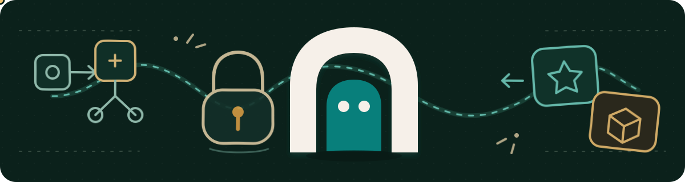

<p align="center">
  
</p>

<h1 align="center">Relmio</h1>

<p align="center"><strong>Bring your AI sign-ins to your tools. Keep every credential where it belongs.</strong></p>

<p align="center">
  <a href="https://www.npmjs.com/package/relmio"></a>
  <a href="https://www.npmjs.com/package/relmio"></a>
  <a href="https://github.com/Demonbane18/relmio/stargazers"></a>
  <a href="https://github.com/Demonbane18/relmio/actions/workflows/ci.yml"></a>
  <a href="LICENSE"></a>
</p>

Relmio provides separate local integrations for ChatGPT, Codex clients, and
SuperGrok. SuperGrok setup does not require or read ChatGPT credentials.

ChatGPT's local flow uses OpenAI's documented Sign in with ChatGPT plan-usage
protocol. Identity, separately granted plan permission, and model/request access
are checked separately. Relmio does not import a personal Codex login or turn
ChatGPT sign-in into an OpenAI Platform API key. SuperGrok uses its own session.
The website's `/api/chat` remains off and returns `410 Gone`; local setup does
not enable hosted chat. See the
[2026-10-05 source check](docs/openai-source-check-2026-10-05.md) for the data
flow, documented limits, unresolved prerequisites, and historical reviews.

Relmio 0.18.6 is the current stable release. The redesigned five-step wizard
is available through npm `latest` and the hosted installers.


The local wizard's **Test AI Chat** console keeps partial response text visible
while it streams. Status distinguishes connection setup, waiting for the first
words, active streaming, completion, interruption, and failure without
announcing every token to assistive technology. **Stop response** preserves
text already received, and reduced-motion preferences keep the same state cues
without animation. This does not change external clients such as n8n.

SuperGrok is a first-class local and VPS setup option in 0.14.0, but the adapter
remains experimental. Live Windows checks covered fresh sign-in, model discovery,
n8n Chat, Assistant node search, and a Calculator workflow. Native Windows CI also
exercises the hosted Git Bash launcher through a real hidden console and verifies
that its portable Node child receives terminal handles. VPS Chat success was
user-reported after Responses API was turned off; VPS Assistant and Calculator
remain unverified.

Existing API-key endpoints are left running and retain their data during an
upgrade; they are no longer shown in the 0.15.0 dashboard. Follow the
[legacy endpoint retirement guide](https://relmio.jpfusin.tech/docs/local-endpoints#retired-api-installations)
to review and stop an exact owned endpoint.

## Quick install

With Node.js 24 or newer on macOS, Linux, WSL, Windows PowerShell, or Command
Prompt:

```bash
npx --yes --ignore-scripts relmio@latest
```
`@latest` selects stable 0.18.6, including the redesigned chooser. Hosted
installers use the same stable default.


On Git Bash, use the hosted launcher. It uses Git for Windows' bundled `winpty`
bridge and a checksum-verified temporary Node.js runtime, even when Node.js 24
is already installed:

```bash
curl -fsSL https://relmio.jpfusin.tech/install.sh | sh
```

If you deliberately run NPX directly from Git Bash 2.38.1, prefix that one
process with `MSYS=enable_pcon`. This does not change global Git configuration.

The command opens the **ChatGPT on my server** route in a foreground setup
wizard on `127.0.0.1` without creating persistent Relmio state. It also works
on a first-run machine with no `.relmio` directory and no local n8n stack;
missing prerequisites appear as actionable steps in the browser instead of
ending the launcher before the page opens. Review exactly what the wizard will
create, then confirm the install. Use `relmio local` only when you explicitly
want the setup route for this computer.

No Node.js yet? The hosted guide has native curl, Homebrew, PowerShell, and
Command Prompt options. Homebrew installs the persistent `relmio` command; it
does not launch the browser. The curl, PowerShell, and Command Prompt
launchers open the foreground wizard with the same platform security checks.

[Open the hosted install guide](https://relmio.jpfusin.tech/install)

## Keep the local dashboard available

For a persistent command, install Relmio with Node.js 24 or newer, then manage
its owner-scoped loopback dashboard explicitly:

```bash
npm install --global --ignore-scripts relmio@latest
relmio start
relmio status
relmio open
relmio stop
```

Without a global install, repeat the full NPX command for each lifecycle
action:

```bash
npx --yes --ignore-scripts relmio@latest start
npx --yes --ignore-scripts relmio@latest status
npx --yes --ignore-scripts relmio@latest open
npx --yes --ignore-scripts relmio@latest stop
```

`relmio start` runs the dashboard in the background without opening a browser.
`relmio open` starts it when needed and opens its private local page.
`relmio status` checks only the verified dashboard process without printing a
session value. `relmio stop` stops only that process; it does not stop or
restart n8n, ngrok, model endpoints, bridges, Assistant companions, or
unrelated containers.

The hosted curl, PowerShell, and Command Prompt launchers can use a verified
temporary Node.js runtime. In that mode Relmio remains a foreground, one-shot
process for that terminal and leaves no persistent command behind.

## Install and update

### Existing ChatGPT and sidecar installations

Installing a newer Relmio package updates the wizard, not an already-running
sidecar. Use the current ownership-attested action for the exact target and
review its plan; see the [maintenance guide](docs/maintenance.md). For an
installed VPS ChatGPT sidecar, that action is **Review sidecar update** under
**Manage the installed ChatGPT session**. It rebuilds only the sidecar and
keeps the ChatGPT sign-in and the one-time key; see
[Update the installed sidecar](docs/vps-and-n8n.md#update-the-installed-sidecar).
Relmio leaves retired API-key gateways and their credential volumes untouched.

Older credential-copy ChatGPT bridges are not silently adopted. In a reviewed
local migration, sign in with a fresh SIWC registration and give the separate
migration consent. Relmio stops only the attested old service after final
confirmation and keeps its credential/workspace volumes offline; it does not
copy the old `auth.json` into the new runtime. If migration state is uncertain,
the old service is not resumed automatically; inspect the retained resources.
Current local OSS use needs no commercial approval, partner client, or secret.
The user still separately grants ChatGPT plan use and confirms the first-use
notice. The VPS guide and SIWC Terms do not resolve persistent remote token
storage, so the implementation makes no provider-approval claim for VPS use.
The Terms' connected-application rule may also conflict with an
OpenAI-compatible endpoint for n8n, and Relmio is not in OpenAI's partner
directory. Both questions are open.
See [VPS and n8n](docs/vps-and-n8n.md) and the
[2026-10-05 source check](docs/openai-source-check-2026-10-05.md).

Relmio also refuses to adopt an earlier SuperGrok development install that
lacks its fresh-session marker. Review that installation separately before
removal or migration.

**Refresh status** shows eight dashboard services: Codex App Server, Codex Chat
Adapter, Grok Build, the owned n8n stack, the ChatGPT plan sidecar, AI Assistant
tools, SuperGrok for n8n, and the local model for n8n. It shows only verified
connection URLs and state, never stored secrets. Select **Add connection** to
use the existing setup flow. Bare `relmio` and `relmio vps` open VPS setup; use
`relmio local` for this computer's setup route.

Choose **Set up SuperGrok for n8n** in the VPS wizard to add
the same private Grok OAuth companion to an existing remote n8n. Review the exact
plan before installation, then complete official device sign-in in your browser.
See [SuperGrok on a VPS](docs/vps-supergrok.md) for Chat Completions settings and
ownership-safe management. No existing n8n restart or provider change is required.

[Learn how to use the local dashboard](docs/local-dashboard.md)

## Pick a path

### I already run n8n

Choose the provider connection or local model that fits the workflow. The
Responses API switch is specific to each integration:

| Connection | Base URL | Value for n8n's API-key field | Use Responses API |
| --- | --- | --- | --- |
| OpenAI plan use | `http://n8n-openai-oauth:10531/v1` | One-time local Relmio bearer | **On** in OpenAI Chat Model node version 1.3 |
| SuperGrok OAuth | `http://n8n-supergrok:14502/v1` | One-time local Relmio bearer | **Off** for workflow model nodes and Chat Hub |
| Local Ollama model for n8n | `http://n8n-local-model:11434/v1` | `local-only` ignored placeholder | **Off** for the Chat Completions recipe |

Choose **ChatGPT for n8n**. Other local tools are available under **More connections and tools**.

### Review hosting and integration plans

Open **Hosting options** from the authenticated wizard to compare managed
local/VM setup with operator-applied private deployment artifacts. The catalog
includes 15 Linux VM presets plus local Docker, manual model/search artifacts
for supported platforms, Daytona configuration handoffs for 15 self-hosted
n8n platforms, authenticated endpoint handoffs, and restricted edge relays.
Generate displays validated settings, requirements, steps and source links;
download the complete ZIP to preserve nested paths, or individual files.

Plan generation does not connect to provider accounts, inspect remote hosts,
provision resources, apply files, or edit/restart your existing n8n. Do not put
secrets in planner inputs; artifact secrets are supplied separately through
the provider's secret facility. All newly researched provider runtime
acceptance is **NOT-RUN**. Manual recipes are not the existing managed SSH
installer. See [Hosting compatibility](docs/hosting-compatibility.md) for
platform constraints and the
[AI Assistant guide](docs/ai-assistant.md#operator-managed-daytona-handoff)
for the external sandbox handoff.

The planner's external endpoint profiles for n8n Cloud, Vercel, Netlify and
Cloudflare Workers are authenticated HTTP integrations, not a general URL
proxy or native n8n adapter. Cloudflare Container SearXNG uses an authenticated
Worker route and an n8n HTTP Request tool; native Assistant header-auth setup
is not interchangeable. Vercel/Railway/Cloudflare Sandbox SDKs also remain
separate from native n8n sandbox providers.

For ChatGPT plan use, sign in through the local wizard, select the registration,
and separately authorize plan permission in ChatGPT. Identity-only sign-in
remains connected but cannot use models. Registrations with the same email stay
separate. Relmio never imports an old Codex credential.

Before the first plan request, confirm **Using ChatGPT plan** in the wizard.
Open **Manage usage** for usage limits and credits. A listed model or connected
account does not prove admission or entitlement. Relmio uses the selected
registration and does not switch accounts or fall back to Platform API billing.
Audio, video, file-management routes, stored conversations, and unsupported
Responses parameters are not available through this gateway. Image generation
needs the optional VPS add-on described below.


For the provider-free local model, choose **Local model for n8n** and follow
the reviewed resource/download flow. The API is unauthenticated, so trust every
container on the selected Docker network. See [Private local models](docs/local-models.md)
for capacity, the exact local/VPS setup, n8n settings, and explicit cache
removal.


The VPS wizard asks you to sign in locally before selecting the server and n8n
target. It confirms the SSH host fingerprint before authentication. Before
final write confirmation it shows the verified server identity, the exact
deployment plan, and short IDs for the reviewed n8n container and network.
Relmio checks those exact IDs again before it writes and before it transfers
the session; a changed ID stops the install and asks for a new review. After
the install completes, status and sign-out need only the same SSH host and
Docker network, so they keep working if n8n is recreated or you change the
SSH login method. The destination gets its own persistent host ID and becomes
the only refresh owner for the selected registration. A transfer that cannot
be confirmed stays frozen for inspection. Relmio does not resume both copies,
restore the sender's old tokens, or restart an old writer automatically.

If SSH connects but the read-only Docker or n8n check fails, the wizard keeps
the verified connection and offers **Retry discovery** without asking for the
password again. Changing the server details requires a fresh identity check.

If a local or VPS install stops partway, status shows it as staged. Select the
account, then review and confirm the resume in the wizard. It continues the
same installation without deleting data or starting a second refresh writer;
if the session had already moved, the one-time key is replaced. Turning plan
use on or off, or a token refresh, before you resume does not block it. If the
destination accepted the session but the acknowledgment was lost, review and
confirm a reconcile. Relmio reads the destination's receipt and finishes the
handoff. Without a receipt, the sender stays frozen and needs a fresh sign-in;
old tokens are never restored. A different account can take over only after a
confirmed "not accepted" result. Relmio refuses if the original receipt
appears, and on a VPS also while a one-off helper container is still present.
If ownership moved but a later finishing step failed, the result still shows
the one-time key once, with a warning not to use it until the reported issue
is resolved.

The local or VPS sidecar is available only to containers on the selected
private Docker network and publishes no host port. n8n does not receive the
provider token. Enter the one-time Relmio bearer from the result screen
manually in n8n:

```text
Base URL: http://n8n-openai-oauth:10531/v1
API key: <one-time Relmio bearer shown by the wizard>
Use Responses API: On
```

The gateway discovers the selected account's model catalog and sends
supported requests to `/v1/responses`. OpenAI filters that catalog by an
undocumented `client_version` parameter, so Relmio sends its pinned Codex
version (0.160.0). OpenAI could change this behavior. The
`/v1/chat/completions` compatibility route translates text messages and
function tools into a Responses request. Function tools go upstream in one
`additional_tools` item, and n8n runs the tools itself. The route allows up to
32 tool calls, 128 KiB of arguments per call, and 2 MiB of streamed arguments
in total. It rejects a named `tool_choice`, tool namespaces, custom tools in
streamed requests, system messages, and inputs it cannot preserve. Chat
clients receive only final-answer text; reasoning items and intermediate
commentary are not passed on. The Responses route passes OpenAI's events
unchanged. On 2026-10-05 a two-turn LangChain tool test passed through the
real gateway on one ChatGPT account, streaming over both routes. That is not a
guarantee for other accounts or models. Audio, video, file-management routes,
stored responses/conversations, moderation, the Responses `image_generation`
tool, and unsupported parameters are rejected; there is no automatic fallback.

On a VPS you can turn on image generation and editing as an opt-in add-on. In
**Manage the installed ChatGPT session**, choose **Check installed account**,
then **Sign in for images**, and enter the code at
`https://auth.openai.com/codex/device`. In n8n, use the OpenAI node's
**Image** actions with the same Base URL and Relmio key, and enter the model
ID `gpt-image-2`. The add-on uses a separate Codex sign-in, the way Hermes
Agent does. OpenAI does not document this route for other apps, so it can stop
working without notice. Images count against your plan's Codex limits, and the
Codex refresh token is stored on the VPS. The ChatGPT plan session is never
used for images. Each request returns one image; masks and URL responses are
not supported. The local sidecar has no image sign-in. See
[Turn on image generation](docs/vps-and-n8n.md#turn-on-image-generation-optional)
for limits and sign-out.

Installing on a server also requires express consent for n8n background
workflows. The wizard does not edit n8n's credentials or Compose configuration.
Existing legacy bridge installations are not silently adopted; they require a
separately reviewed migration and fresh SIWC sign-in. Identity sign-in or an
installer confirmation cannot grant plan permission; that is a separate user
authorization in ChatGPT.
OpenAI's VM guide and SIWC Terms leave persistent remote VM storage unresolved.
See the [VPS guide](docs/vps-and-n8n.md) and the
[2026-10-05 source check](docs/openai-source-check-2026-10-05.md) before
choosing that route.

For SuperGrok, choose **SuperGrok for n8n**, select
its container and network, then review the private installation. Copy the
one-time Relmio client credential and use `http://n8n-supergrok:14502/v1`.
`grok-build` remains a legacy routing alias; use a freshly discovered model
where the n8n control supports it. Then run:

```sh
relmio grok login --n8n
```

Approve the official device sign-in. The credential entered in n8n's API key
field authorizes access to Relmio only; it is not an xAI API key. For workflow
model nodes, turn **Use Responses API** off and choose **From list**. For Chat
Hub, turn it off in **Settings > Chat > OpenAI > Edit provider**. The Assistant
custom endpoint uses a discovered model name in its text field; it is separate
from the Chat setting. An earlier development install without the fresh-session
marker is not upgraded automatically; migration requires a separately reviewed
path. Sign out with `relmio grok logout --n8n`. This
companion publishes no host port.
### I want a provider-free model for n8n
First use does not require an existing `.relmio` directory. Open the dashboard
with `npx --yes --ignore-scripts relmio@latest local`; it initializes dashboard
state as needed. The local-model installation requires an existing running n8n
container and does not install n8n. If you do not yet run local n8n, set it up
separately before selecting a model.

Choose **Local model for n8n** to install one CPU-based Ollama model beside an
existing local n8n container, or use the dedicated VPS model setup route. The
wizard measures Docker-visible memory, CPU, and disk, lets you select from the
allowlisted model catalog, and reviews the exact resources and download before
you confirm. The runtime uses the selected existing Docker network and
publishes no host port. It needs no ChatGPT sign-in, OAuth credential, or
provider API key.

The model API has no authentication: all containers on the selected network
are trusted. Ollama cloud features are disabled, but first-time image and model
downloads still require internet access. n8n uses the private base URL and an
ignored placeholder key; see the [local-model guide](docs/local-models.md) for
capacity estimates, setup, configuration, retry, and explicit cache removal.
This is a workflow Chat Model, not n8n AI Assistant sandbox setup or proof of
reliable tool calling.

Model-only smoke checks covered local Docker and a Hostinger VPS. Linux
full-stack acceptance is tracked in [issue #86](https://github.com/Demonbane18/relmio/issues/86).
A reported 120-second local inference timeout on cold model loads remains open.
Cold loads and host pressure can exceed caller deadlines, and CPU inference can
be slow. These checks prove bounded inference only, not a working workflow,
tool calling, model quality, throughput, or support on other hosts.

Relmio's VPS model setup is tested on Hostinger KVM VPS. Other Linux VPS hosts,
including Hetzner, and all hosting-plan platforms are experimental. See
[Hosting compatibility](docs/hosting-compatibility.md) for account guidance,
managed prerequisites, manual platform routes, and provider limits.
Use the actual image/administrator username and **Local SSH agent**
or approved password; verify the host fingerprint before authentication.
The host needs rootful Docker Engine, Compose v2 and Buildx build tooling with
its existing `default` Docker context targeting the local n8n daemon, existing
n8n on an eligible bridge, measured capacity and a safe root-owned `/docker`.
Relmio does not provision the VM, install Docker/n8n, or change SSH policy.
Final review also discloses temporary root-only Buildx state inside the owned
operation lock. Verified cleanup removes only that state; uncertain cleanup
retains the lock for administrator inspection, never automatic n8n/cache deletion.

Verified **Passwordless sudo -n (model only)** supports this model flow, not
OAuth bridge, AI Assistant or SuperGrok VPS operations; those retain their
existing approved direct-root requirement. Agent keys stay local, and a
persistent dashboard must be launched from the correct agent environment.
Render service SSH is unsupported by the managed installer, but a separate
paid private model service is a manual option with its own disk and internal
DNS. See [Hosting compatibility](docs/hosting-compatibility.md) for all managed
and manual routes, image-qualified usernames, agent setup and provider limits.


### I do not have n8n yet

Choose **Set up new n8n**. Relmio creates a separate n8n stack and walks
you through the ngrok domain, token, and Basic Auth fields. Only the new n8n
route is public. Its model bridge, Code Sandbox, and optional SearXNG stay off
the host network.

[Read the new n8n guide](https://relmio.jpfusin.tech/docs/local-n8n-stack)

### I want to use SuperGrok

The experimental **SuperGrok** adapter uses official OAuth with your eligible
subscription. Local apps and n8n use `/v1/chat/completions` and a separate
local Relmio bearer. The current account catalog listed `grok-4.6` and
`grok-4.5`; discovery is not per-model tool proof. Explicit `grok-4.6` passed
the n8n Assistant node-catalog tool and a Calculator workflow (`317 × 29 =
9193`). `grok-build` remains a legacy alias, not a claim that every request
uses Grok 4.6. Existing n8n is never reconfigured or restarted by this setup.
No xAI API key is requested.

After installing the local SuperGrok endpoint, sign in:

```sh
relmio grok login
```

Approve the displayed code on the official provider page. To sign out later,
run `relmio grok logout`. These commands act only on the attested Relmio runtime.

[Read the SuperGrok guide](https://relmio.jpfusin.tech/docs/local-endpoints#supergrok-development-backends)

## n8n AI Assistant tools

Choose **n8n AI Assistant tools** in the local browser wizard to add Code
Sandbox beside an existing n8n container. SearXNG web search is optional and
off by default. Relmio shows the sandbox key and n8n settings once. It does not
change or restart n8n.

Configure the Assistant's supported model connection directly in n8n. The privileged local runner is for
development and testing; n8n recommends Daytona for production.

[Read the AI Assistant guide](https://relmio.jpfusin.tech/docs/ai-assistant)

## Codex App Server and Chat Adapter

The local **Codex App Server** keeps its WebSocket client protocol and relays
it to the official Codex App Server over stdio, using the selected SIWC
registration's public Responses access token. It is a high-trust target for a
trusted native client owned by the same account holder, not a browser service
or a general OpenAI `/v1` gateway. The relay forwards every client JSON-RPC
call except a short deny-list to the official App Server, which runs as the
same user that owns the SIWC store. Connect only trusted local clients. Agent
spawning and deferred `tool_search` are disabled; unsupported account/auth,
connector, marketplace, plugin, and configuration mutations are rejected.
This is not full App Server feature parity.

The **Codex Chat Adapter** is a separate, read-only conversational HTTP
interface for trusted local backends. Its bearer does not grant the App
Server's broader surface. The two targets use the selected SIWC account but
keep their local credentials and behavior separate.

Direct WebSocket connections close shortly before the access token expires.
Reconnect and explicitly resume a known thread; its account-bound record
survives relay restarts. Unknown or foreign threads are rejected, and
interrupted turns are not replayed.

## Provider account policy

Each SIWC registration is bound to a verified issuer, issued client ID, and
subject. Email is a display label; matching addresses do not merge
registrations. Sign-in, permission to use a ChatGPT plan, and successful model
requests are separate states. Relmio does not choose another registration or
change billing after an error.

Sign-out clears local tokens and attempts OpenAI revocation. If remote
revocation cannot be confirmed, the wizard says so and points to ChatGPT's
disconnection controls. Local cleanup is not proof of remote revocation or
provider-side deletion.

The direct Codex target is a high-trust WebSocket relay to the official App
Server using SIWC credentials; the Codex Chat Adapter is a narrower read-only
contract. Neither uses a separate Codex device-code login or exposes a general
OpenAI Platform API.

Managed ChatGPT plan use does not configure an OpenAI Platform API key or fall
back to separately billed API access. Configure unrelated API-key connections
and operator-generated hosting artifacts separately in n8n or on the target
platform. Retired API installations and their data remain untouched.

The experimental SuperGrok adapter uses the pinned official Grok CLI for fresh
OAuth/device sign-in and sign-out in its own private volume. The direct HTTP
handler reads only that runtime's marked session to call xAI's documented CLI
chat proxy. It does not inspect another app's credentials, import tokens,
replay browser cookies, or accept an xAI API key. The CLI remains the sole
credential writer; the HTTP handler never consumes refresh tokens.

Local apps use `/v1/chat/completions` with a separate Relmio client bearer.
`grok-build` is a supported legacy routing alias; a fresh authenticated catalog
can provide current routing names, but a listing does not prove a model's tool
behavior. n8n executes its own tools and returns matching results. Browser
bundles must not hold the local bearer or call it directly.

The ChatGPT gateway uses only the selected registration. It does not switch
accounts or fall back to a separately billed API after an authentication,
permission, unsupported-capability, rate-limit, or usage error.

## Common problems

- **Docker is not running.** Start Docker Desktop or Docker Engine, then open a
  fresh wizard session.
- **Authentication fails.** Close old sign-in tabs, run `relmio open`, and use
  the private page opened by the active dashboard process.
- **Local image build failed.** Check Docker, disk space, and registry access.
- **Git Bash says stdin or stdout is not a TTY.** Use the hosted curl launcher,
  which applies the bundled `winpty` bridge. For direct NPX on Git Bash 2.38.1,
  prefix that process with `MSYS=enable_pcon`. Do not add a global Git setting.

[Open troubleshooting](https://relmio.jpfusin.tech/docs/troubleshooting)

## Guides

- [Getting started](https://relmio.jpfusin.tech/docs/getting-started)
- [Local endpoints and n8n bridge](https://relmio.jpfusin.tech/docs/local-endpoints)
- [New local n8n + ngrok](https://relmio.jpfusin.tech/docs/local-n8n-stack)
- [VPS and n8n](https://relmio.jpfusin.tech/docs/vps-and-n8n)
- [SuperGrok on a VPS](https://relmio.jpfusin.tech/docs/vps-supergrok)
- [n8n AI Assistant](https://relmio.jpfusin.tech/docs/ai-assistant)
- [Security and policy notes](https://relmio.jpfusin.tech/docs/security)
- [Private local models](https://relmio.jpfusin.tech/docs/local-models)
- [Hosting compatibility](https://relmio.jpfusin.tech/docs/hosting-compatibility)
- [Reference](https://relmio.jpfusin.tech/docs/reference)
- [Changelog](https://relmio.jpfusin.tech/changelog)

## Support

Relmio is free to use. If it helped you, you can buy me a coffee.

<a href="https://ko-fi.com/paldogies" target="_blank" rel="noopener noreferrer"></a>

## Legal

Relmio is an unofficial, community-maintained project. It is not affiliated
with, endorsed by, or sponsored by OpenAI.

Treat ChatGPT/Codex credentials like passwords. Use only your own account. Do
not pool, share, forward, or sell access tokens. Any request made with those
credentials must be authorized by the account owner.

You are responsible for following OpenAI's [Terms of Use](https://openai.com/policies/terms-of-use/),
[Usage Policies](https://openai.com/policies/usage-policies/), and any other
agreement that applies to your account.

> [!WARNING]
> **Do not bypass rate limits, restrictions, or safeguards.**

Relmio is provided as-is without warranties. OpenAI or an upstream service may
change or discontinue access at any time. You accept the risks of using this
experimental community project.
