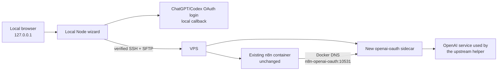
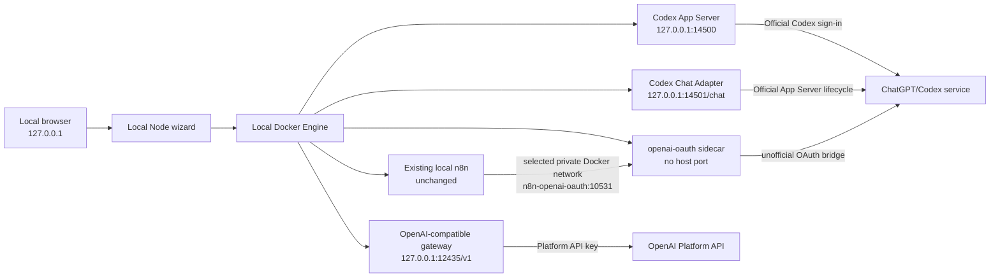

# Architecture and n8n safety boundary

## Design

The wizard runs on the user's computer. It authenticates locally, opens one
verified SSH connection, performs read-only discovery, shows a plan, and then
creates a separate sidecar project on approval.



## Local endpoint architecture

The local installer is a separate path in the same browser wizard. It uses the
local Docker Engine and never opens SSH or writes to a VPS. Three options create
loopback endpoints; a fourth creates a private sidecar beside an existing local
n8n container without changing n8n itself.



The four options are intentionally not interchangeable:

| Target | Wire protocol | Upstream credential |
|---|---|---|
| `openai-api` | OpenAI-compatible HTTP `/v1` | OpenAI Platform API key |
| `codex-chatgpt` | Official Codex App Server JSON-RPC | ChatGPT sign-in managed by Codex |
| `codex-chat` | Relmio-specific HTTP `POST /chat` | ChatGPT sign-in managed by Codex |
| `n8n-openai-oauth` | Private OpenAI-compatible HTTP `/v1` for n8n only | Local ChatGPT OAuth copied into a private sidecar volume |

Relmio never adapts a ChatGPT/Codex credential into the local `/v1` gateway.
The OpenAI gateway replaces the caller's Relmio capability with the
protected Platform key only at the upstream boundary. The native Codex service
keeps the initialization, thread, turn, approval, and event protocol. The
adapter invokes that same official lifecycle behind a bounded, read-only
conversational contract without claiming OpenAI API compatibility. Its model
sandbox denies network access and uses a root-deny filesystem policy with only
minimal runtime paths plus `/workspace` readable; `/home/node/.codex` is
explicitly denied so a model turn cannot read the persisted ChatGPT session.
The n8n bridge is a separate, explicitly unofficial/private compatibility
path. It is not a Platform-key gateway, is not exposed to arbitrary local
clients, and is never described as supported or policy-approved.

Each of the three endpoint projects publishes exactly one literal `127.0.0.1`
binding and requires a generated bearer capability. The n8n sidecar publishes
no host port; only containers on its selected existing network can resolve its
private hostname. Their managed roots are
`~/.relmio/local/openai-api`, `~/.relmio/local/codex-chatgpt`, and
`~/.relmio/local/codex-chat`, with the sidecar under
`~/.relmio/local/n8n-openai-oauth`. The Codex credentials and workspaces use
target-specific private named Docker volumes; no host directory or Docker
socket is mounted. See [Local Docker endpoints](local-endpoints.md) for setup
and trust limitations.

Before installation, Relmio resolves the selected Docker context to a local
Unix socket and pins that exact socket on every later Docker command. Remote
Docker contexts and Docker environment overrides are rejected. Each endpoint
gets a random installation ID, a unique Compose project name, and matching
ownership labels; existing resources must attest to that identity before an
update or recovery action can run.

For `n8n-openai-oauth`, the reviewed plan also records the exact running n8n
container ID/name and Docker network ID/name. Relmio re-discovers them before
mutation, rejects an occupied `n8n-openai-oauth` alias, and attaches only the
new sidecar to the already-existing network. It never connects, edits, executes
inside, rebuilds, restarts, stops, or recreates n8n. The source OAuth file is
preserved; validated JSON is copied over stdin into a private labeled volume
with no logging or network access during seeding.

The local endpoint installer supports macOS, Linux, and Linux under WSL2.
Native Windows is rejected before filesystem or Docker mutation because this
release relies on owner-only POSIX modes for managed credentials.

## Why this integration is possible

The design combines four existing interfaces rather than changing n8n:

1. The n8n OpenAI credential accepts a custom Base URL.
2. The pinned bridge implements OpenAI-compatible model, Responses, and chat
   completions routes.
3. Docker Compose can attach a separate project to an existing external
   network.
4. Docker DNS resolves the private sidecar hostname from the n8n container.

n8n therefore talks to the private sidecar with its normal OpenAI request
shape. The sidecar handles upstream OAuth authentication with its mounted
credential. No OpenAI Platform API key is created.

## VPS mutation boundary

The installer can write only:

```text
/docker/n8n-openai-oauth/
├── .managed-by-n8n-openai-oauth
├── Dockerfile
├── docker-compose.yml
└── auth/
    └── auth.json
```

Its deployment commands always include:

```text
--project-name n8n-openai-oauth
--file /docker/n8n-openai-oauth/docker-compose.yml
```

The only service passed to `build` or `up` is `openai-oauth`, and `up` includes
`--no-deps`.

## Local sidecar mutation boundary

The local wizard writes only its managed target directory:

```text
~/.relmio/local/n8n-openai-oauth/
├── .managed-by-relmio.json
├── .dockerignore
├── Dockerfile
└── docker-compose.yml
```

The copied OAuth credential exists only in a private labeled Docker volume. A
random installation ID produces a collision-resistant Compose project name,
and every build/start/remove command names that exact project and only the
`openai-oauth` service. The selected n8n network is declared external, so
sidecar cleanup cannot own or remove it.

## Existing n8n operations

| Operation | Wizard behavior |
|---|---|
| Read running container list | Allowed |
| Read n8n network names | Allowed |
| Run a command inside n8n | Not used during installation |
| Edit n8n Compose | Forbidden |
| Build n8n image | Forbidden |
| Restart or stop n8n | Forbidden |
| Recreate or remove n8n | Forbidden |
| Publish a new VPS port | Forbidden |
| Add a Traefik route | Forbidden |

## Why the Base URL uses a service name

Docker Compose can attach a separate project to an existing external network.
Containers on that network can use Docker DNS to reach a service by name.
That is why n8n uses:

```text
http://n8n-openai-oauth:10531/v1
```

It must not use `127.0.0.1`, and the VPS does not need a public port. See
[Docker's external-network documentation](https://docs.docker.com/compose/how-tos/networking/#use-an-existing-network).

## Request paths

The n8n OpenAI credential validates with:

```text
GET /v1/models
```

The OpenAI Chat Model can use:

```text
POST /v1/responses
```

The compatibility path is:

```text
POST /v1/chat/completions
```

The placeholder API key satisfies n8n's required credential field. The
sidecar authenticates upstream with the mounted OAuth file.

## Technical sources

- [`openai-oauth` v2.0.0 server routes](https://github.com/EvanZhouDev/openai-oauth/blob/v2.0.0/packages/openai-oauth/src/server.ts)
- [`openai-oauth` v2.0.0 login flow](https://github.com/EvanZhouDev/openai-oauth/blob/v2.0.0/packages/openai-oauth/src/login.ts)
- [n8n OpenAI credential documentation](https://docs.n8n.io/integrations/builtin/credentials/openai/)
- [n8n OpenAI credential source](https://github.com/n8n-io/n8n/blob/master/packages/nodes-base/credentials/OpenAiApi.credentials.ts)
- [Docker Compose networking](https://docs.docker.com/compose/how-tos/networking/)
- [Docker Compose `expose`](https://docs.docker.com/reference/compose-file/services/#expose)
- [Docker port publishing](https://docs.docker.com/engine/network/port-publishing/)
- [OpenAI API authentication](https://developers.openai.com/api/reference/overview#authentication)
- [Codex authentication](https://learn.chatgpt.com/docs/auth)
- [Codex App Server](https://learn.chatgpt.com/docs/app-server)

## Failure behavior

- Invalid host, port, username, container, or network names are rejected.
- A changed SSH fingerprint blocks authentication.
- An existing unmanaged install directory is not overwritten.
- Invalid OAuth JSON is rejected before Docker changes.
- A failed Compose validation stops before build.
- A failed build or start does not trigger an n8n action.
- An unexpected host-port mapping causes verification to fail.
- The SSH connection closes after installation or when the wizard stops.
- A local port collision blocks a new local install or port change.
- An existing unmanaged or symlinked local path is never overwritten.
- A local service fails verification unless Docker reports the exact planned
  `127.0.0.1` publication.
- A remote Docker context, inherited Docker selector, foreign Compose resource,
  or mismatched managed identity blocks local mutation.
- A Codex login failure returns a sanitized status without returning App
  Server output or ChatGPT tokens.
- A chat adapter request with a browser Origin, invalid bearer, malformed body,
  protocol overflow, timeout, or failed turn is rejected with a sanitized
  response and its App Server helper is terminated.
