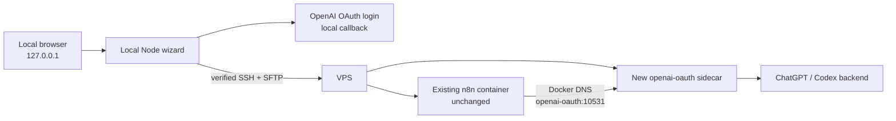

# Architecture and n8n safety boundary

## Design

The wizard runs on the user's computer. It authenticates locally, opens one
verified SSH connection, performs read-only discovery, shows a plan, and then
creates a separate sidecar project on approval.



## The mutation boundary

The installer can write only:

```text
/docker/n8n-openai-oauth/
├── .managed-by-n8n-openai-oauth
├── Dockerfile
├── docker-compose.yml
└── auth/
    └── auth.json
```

Its deployment commands always include:

```text
--project-name n8n-openai-oauth
--file /docker/n8n-openai-oauth/docker-compose.yml
```

The only service passed to `build` or `up` is `openai-oauth`, and `up` includes
`--no-deps`.

## Existing n8n operations

| Operation | Wizard behavior |
|---|---|
| Read running container list | Allowed |
| Read n8n network names | Allowed |
| Run a command inside n8n | Not used during installation |
| Edit n8n Compose | Forbidden |
| Build n8n image | Forbidden |
| Restart or stop n8n | Forbidden |
| Recreate or remove n8n | Forbidden |
| Publish a new VPS port | Forbidden |
| Add a Traefik route | Forbidden |

## Why the Base URL uses a service name

Docker Compose can attach a separate project to an existing external network.
Containers on that network can use Docker DNS to reach a service by name.
That is why n8n uses:

```text
http://openai-oauth:10531/v1
```

It must not use `127.0.0.1`, and the VPS does not need a public port. See
[Docker's external-network documentation](https://docs.docker.com/compose/how-tos/networking/#use-an-existing-network).

## Request paths

The n8n OpenAI credential validates with:

```text
GET /v1/models
```

The OpenAI Chat Model can use:

```text
POST /v1/responses
```

The compatibility path is:

```text
POST /v1/chat/completions
```

The placeholder API key satisfies n8n's required credential field. The
sidecar authenticates upstream with the mounted OAuth file.

## Failure behavior

- Invalid host, port, username, container, or network names are rejected.
- A changed SSH fingerprint blocks authentication.
- An existing unmanaged install directory is not overwritten.
- Invalid OAuth JSON is rejected before Docker changes.
- A failed Compose validation stops before build.
- A failed build or start does not trigger an n8n action.
- An unexpected host-port mapping causes verification to fail.
- The SSH connection closes after installation or when the wizard stops.

