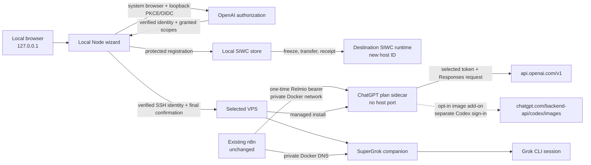
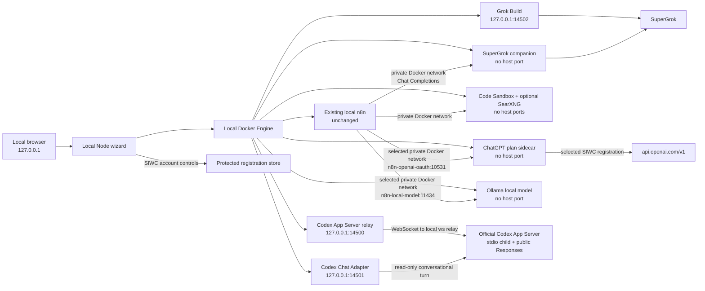

# Architecture and n8n safety rules

## Local SIWC and VPS n8n

The wizard runs on the user's computer. It verifies a new local SIWC
registration, selects a model/account state, and shows the installation plan
before writes. Identity authentication and ChatGPT plan permission are separate.
SuperGrok uses its own official device sign-in and does not read ChatGPT
credentials.

```mermaid
flowchart LR
  B["Local browser<br>127.0.0.1"] --> W["Local Node wizard"]
  W -->|"system browser + loopback PKCE/OIDC"| A["OpenAI authorization"]
  A -->|"verified identity + granted scopes"| W
  W -->|"protected registration"| L["Local SIWC store"]
  W -->|"verified SSH identity + final confirmation"| V["Selected VPS"]
  L -->|"freeze, transfer, receipt"| R["Destination SIWC runtime<br>new host ID"]
  N["Existing n8n<br>unchanged"] -->|"one-time Relmio bearer<br>private Docker network"| S["ChatGPT plan sidecar<br>no host port"]
  S -->|"selected token + Responses request"| O["api.openai.com/v1"]
  S -.->|"opt-in image add-on<br>separate Codex sign-in"| I["chatgpt.com/backend-api/codex/images"]
  V -->|"managed install"| S
  V --> Q["SuperGrok companion"]
  N -->|"private Docker DNS"| Q
  Q --> X["Grok CLI session"]
```

The hosted website's `/api/chat` is a separate route and returns `410 Gone`.
This does not add a commercial-approval or partner-client prerequisite to the
local open-source SIWC flow, which uses documented dynamic registration and a
separate ChatGPT plan grant. The disabled website route is outside this design.

## Local endpoints

Local endpoint installation uses the local Docker Engine. It does not open SSH
or write to a VPS. Loopback endpoints bind to `127.0.0.1`; n8n companions join
only a selected existing private Docker network and publish no host port.

```mermaid
flowchart LR
  B["Local browser<br>127.0.0.1"] --> W["Local Node wizard"]
  W --> D["Local Docker Engine"]
  W -->|"SIWC account controls"| A["Protected registration store"]
  D --> G["Grok Build<br>127.0.0.1:14502"]
  D --> C["Codex App Server relay<br>127.0.0.1:14500"]
  D --> H["Codex Chat Adapter<br>127.0.0.1:14501"]
  D --> N["Existing local n8n<br>unchanged"]
  D --> S["ChatGPT plan sidecar<br>no host port"]
  D --> X["Code Sandbox + optional SearXNG<br>no host ports"]
  D --> Q["SuperGrok companion<br>no host port"]
  D --> M["Ollama local model<br>no host port"]
  N -->|"selected private Docker network<br>n8n-openai-oauth:10531"| S
  N -->|"private Docker network"| X
  N -->|"selected private Docker network<br>n8n-local-model:11434"| M
  N -->|"private Docker network<br>Chat Completions"| Q
  C -->|"WebSocket to local ws relay"| T["Official Codex App Server<br>stdio child + public Responses"]
  H -->|"read-only conversational turn"| T
  S -->|"selected SIWC registration"| O["api.openai.com/v1"]
  G --> P["SuperGrok"]
  Q --> P
```

These targets have different protocols and trust boundaries:

| Target | Wire protocol | Credential and intended client |
|---|---|---|
| `xai-grok-build`, experimental | Relmio `POST /chat` and OpenAI-compatible Chat Completions `/v1` | Fresh official Grok CLI OAuth session plus a local bearer; trusted local clients |
| `n8n-supergrok-oauth`, experimental | Private Chat Completions `/v1` | Separate Grok CLI session and one-time local bearer; selected n8n only |
| `codex-chatgpt` | Codex App Server JSON-RPC over local WebSocket relay | Selected SIWC registration plus a high-trust local bearer for a trusted native client |
| `codex-chat` | Relmio `POST /chat` | Selected SIWC registration plus a separate bearer for a read-only local backend |
| `n8n-openai-oauth` | Private `/v1/models`, `/v1/responses`, and limited Chat Completions compatibility; on a VPS, optional `/v1/images/generations` and `/v1/images/edits` | Selected SIWC registration plus one-time Relmio bearer; selected n8n network only. Image routes use a separate opt-in Codex sign-in stored on the VPS |
| `n8n-ai-assistant` | n8n Instance AI Code Sandbox plus optional SearXNG JSON search | Generated sandbox key; model-provider credential configured directly in n8n |
| `n8n-local-model` | Private OpenAI-compatible Chat Completions `/v1` for n8n | No provider credential; Ollama API is unauthenticated |

The native Codex App Server relay preserves the existing WebSocket client
protocol. It bridges to the official App Server over stdio and supplies the
selected SIWC access token to the child as `ACCESS_TOKEN`; the child uses the
public Responses API. The raw App Server target remains high trust. Same-UID
tools may inspect their own process environment or files, so Relmio does not
claim OS isolation from an authorized native client or its tools. The Chat
Adapter is a separate read-only conversational profile with its own local
bearer and no browser-origin support.

The WebSocket access-token lease is not renewed in place. The relay closes a
socket shortly before token expiry; reconnect obtains a fresh token. Thread
resume is limited to account-bound IDs held by the same live relay process, and
partial turns are never replayed. A relay restart loses its thread map.

## Registration, transfer, and data boundaries

Each ChatGPT registration is keyed by verified issuer, issued client ID, and
subject. Email is a display label, not a merge key. Plan permission is taken
from returned scopes, not the requested scope list or a local checkbox.
Identity-only accounts remain connected but cannot make plan requests.

Provider tokens stay in protected per-registration records on the owning local
or installed runtime. Browser APIs return safe account state and model metadata,
not provider tokens or filesystem paths. A generated n8n bearer is distinct
from the OpenAI session, appears once, and is represented in Compose by its
verifier. n8n credentials are entered manually by the owner.

A local or VPS transfer initializes a distinct destination host ID, binds the
reviewed registration/client/generation/owner/target, and freezes the source
before transfer bytes are sent. Destination receipt attestation precedes
clearing source tokens. Unknown outcomes remain frozen for inspection, never
restore old source tokens, and never permit both installations to refresh.

The local n8n sidecar re-attests its selected n8n container, Docker host and
network before writing. It publishes no host port and does not edit, execute
inside, rebuild, restart, stop, recreate, or change network membership on n8n.
VPS installs confirm the SSH fingerprint before authentication and require a
separate final confirmation before remote writes. Existing legacy credential-
copy installations require fresh SIWC sign-in and a separately reviewed
migration; they are not silently imported or overwritten.

OpenAI's self-hosted VM guide and SIWC Terms do not resolve whether persistent
remote VM token storage is allowed. The implementation's host ID, freeze,
receipt, and operator-confirmation controls do not settle that provider
question. See [VPS and n8n](vps-and-n8n.md) and the
[2026-10-05 OpenAI source check](openai-source-check-2026-10-05.md).

## n8n mutation boundary

| Operation | Wizard behavior |
|---|---|
| Read running container list | Allowed |
| Read n8n network names | Allowed |
| Run a command inside n8n | Not used during installation |
| Edit n8n Compose | Forbidden |
| Build or modify n8n image | Forbidden |
| Restart, stop, recreate, or remove n8n | Forbidden |
| Publish a new VPS port | Forbidden |
| Add a Traefik route | Forbidden |

The ChatGPT sidecar install itself needs explicit consent for n8n background
workflow use. That consent is not the separate ChatGPT plan grant. Relmio does
not edit n8n's API credential; the operator manually enters the one-time
Relmio bearer and private base URL.

## Local platform and recovery constraints

The local endpoint installer supports native Windows with Docker Desktop,
macOS, Linux, and Linux under WSL2. Windows SIWC storage uses the current-account
ACL verifier; POSIX hosts use owner-only modes. Source inspection does not prove
native Windows acceptance.

Unexpected transfer, ownership, process-stop, or cleanup state fails closed.
Do not inspect or copy old token files, activate a second refresh owner, or
publish port `10531` as a workaround. For account consent, usage-limit,
sign-out, and transfer recovery, see [Troubleshooting](troubleshooting.md).
